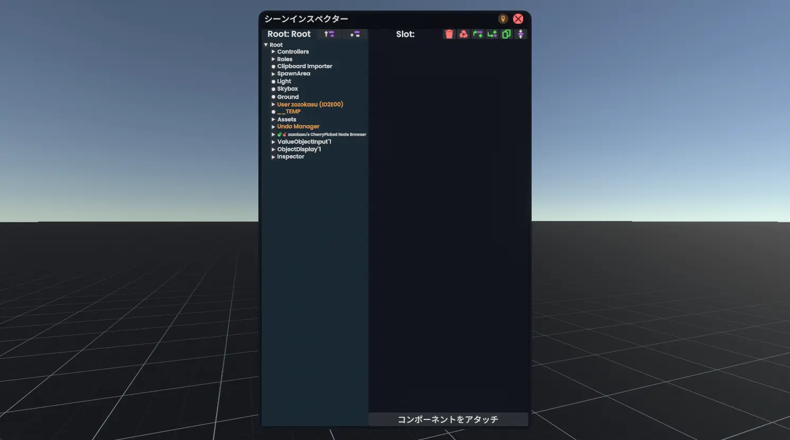
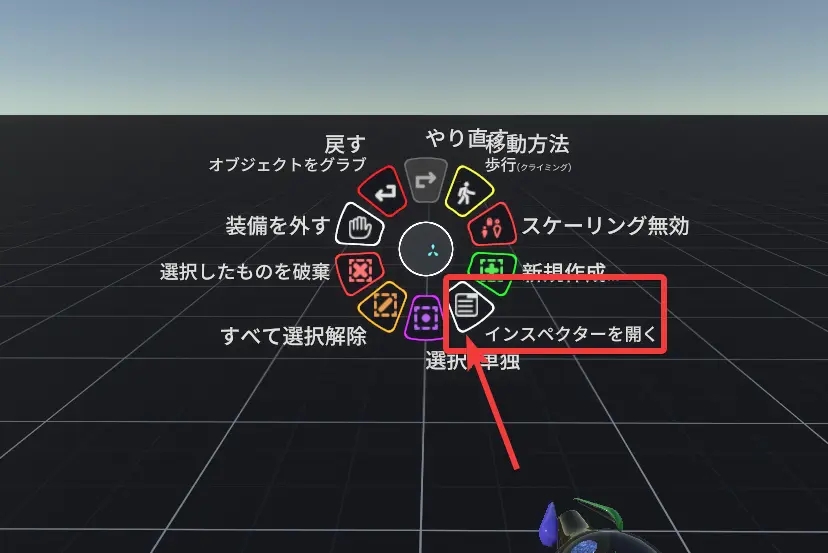
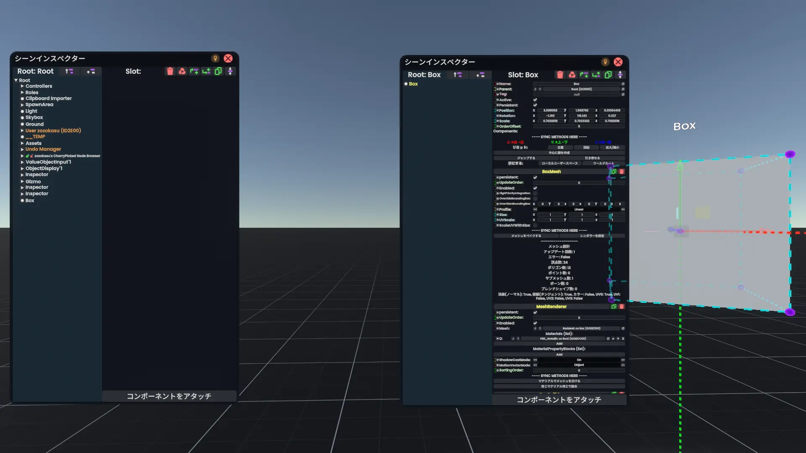

**インスペクター**は(Inspector)は、Slotの情報を表示したり編集する機能を持つパネルです。
Resoniteにおいては、Slotの情報だけでなくワールド内のSlotの一覧を表示する機能も一緒になっています。
> [!note] ヒント - Slotについて
> Slotとは、UnityでいうGameObjectに相当します。

> [!info] Resoniteから一歩踏み出す - 「インスペクター」
> 「インスペクター」という存在自体はResonite特有のものというわけでもなく、UnityやUnrealEngineのエディタにも同名の似たような機能が搭載されています。特に見た目や機能はUnityのものとよく似ています。
## インスペクターをみる

**DevToolを装備した状態で**コンテキストメニューを開くと、「インスペクターを開く」という項目が追加されています。これをクリックすると、目の前にインスペクターが出現します。

*何も選択してない状態のインスペクター（左）とオブジェクトを選択してから開いたインスペクター（右）*
- 何も選択しないでインスペクターを開いた場合、**ワールドルート以下のSlot階層構造**のみが表示されます。

- なにかを選択してからインスペクターを開いた場合、**選択したSlot以下の階層構造**と、**選択したSlotの情報・コンポーネント**が表示されます。
## インスペクターの使い方
### インスペクターの見方
左側にはスロットの一覧が表示されています。Slotを選択すると、右側にそのオブジェクトの情報が表示されます。
> [!info] Resoniteから一歩踏み出す
>インスペクター左側のオブジェクト一覧を指す言葉として「**ヒエラルキー**」という言葉が使われることがあります。
> - Resoniteに限らずUnityやUnrealEngineのエディタでも似たようなものが存在しますし、そもそも階層構造で表示されたリスト自体「ヒエラルキー」と呼ばれることの多い概念です。
### コンポーネントのアタッチ
### Slotの追加・削除・複製
| アイコン                                                           | 機能の説明                                                          |
|----------------------------------------------------------------|----------------------------------------------------------------|
|                       | 【子Slotを追加】選択中のSlotの子にSlotを追加します。                               |
|                   | 【親Slotを挿入】選択中のSlotと親Slotの間にSlotを挿入します。                         |
|                          | 【Slotを削除】選択中のSlotを削除します。                                       |
 |  | 【アセットを残してSlotを削除】選択中のSlotを削除しますが、そのSlotが参照（使用）しているアセットは削除しません。 |
|                        | 【Slotを複製】選択中のSlotを複製します。                                       |
### 階層の移動
