ResonitePackageでない、fbx・unitypackage形式で配布されているアバターのアップロード方法を説明します。

**Unity上で改変した後のアバターについてはここでは説明しません。**
## 必要なもの
### VR、またはVRをもっている人（推奨）
- 「2. 3Dモデルをアバターにする」の作業はVRのほうが正確にできます。
  - デスクトップでもできますが、すこしやりづらいです。
### 前提知識
以下の項目の細かい説明は省きます。
- [Resoniteの基本操作](https://resonite-jp-guide.zozoka.su/BasicControls/1-fourButtons)
  - グラブ、プライマリー、セカンダリー、コンテキストメニューとかのこと
- [インベントリの操作](https://resonite-jp-guide.zozoka.su/inventory/inventory)
  - アイテムを保存する方法
- [DevToolの最低限の使い方](../tool-usage/devTool.md)
  - 装備のやりかた、選択、インスペクターを開く、のやりかた
### Resoniteのアカウント
- 最悪無くても大丈夫ですが……

## 1. アバターを3Dモデルとしてインポートする
#### 説明で使うアバター
[【オリジナル３Ｄモデル】Kuzunoha_Aftermath](https://atelier-krull.booth.pm/items/6182678)
VRChat等でよく使われるアニメ調のアバターを想定して説明します。

### 1.1. 作業用のワールドを開く
ホームワールドは少し重たいので作業用のなにもないワールドを開きましょう。
1. ダッシュメニューから「新規ワールドを作成」を選択
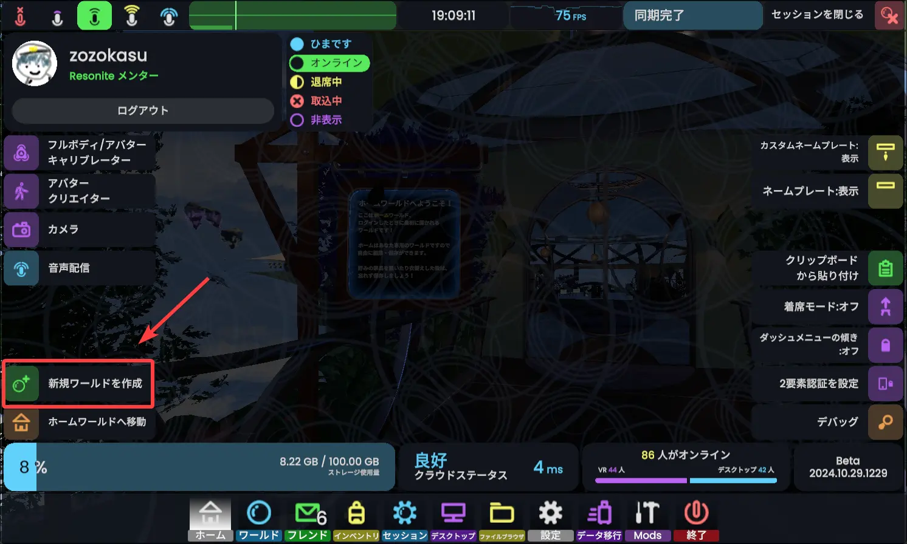
2. テンプレートから「Grid」を選択、アクセスレベルは「プライベート」に設定。
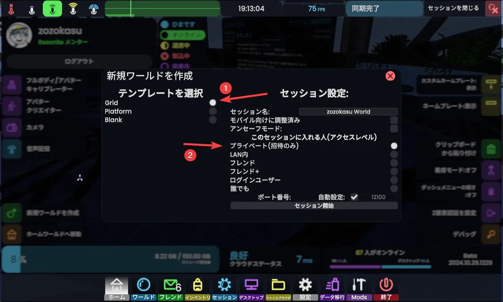

このような何もないワールドができます。
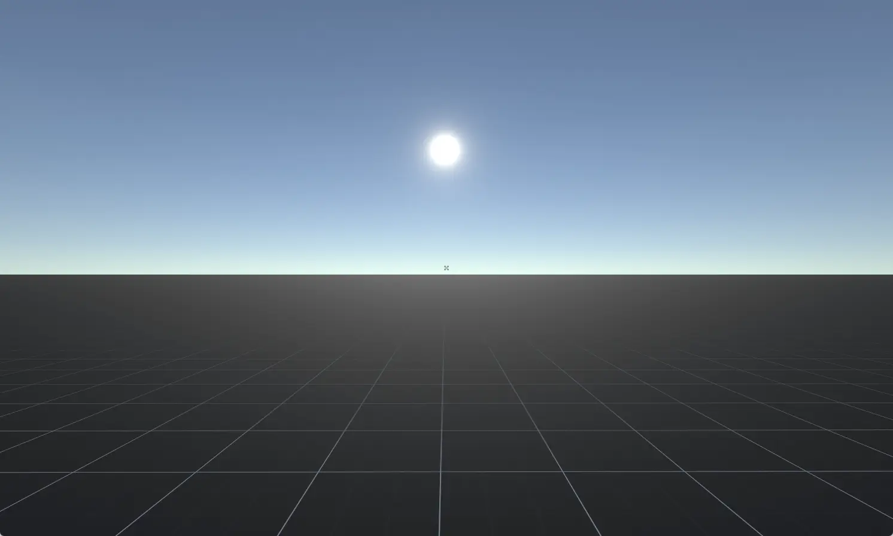
>[!note] セッションアクセスレベル
> 「ログインユーザー」、「誰でも」にすると作業中に見知らぬ人が入ってくる可能性があります。
> プライベート、またはフレンド、フレンド+にしておくのが無難です。 
> また、作業中に他の人が入ってきても気にならないように、セッションの名前を「作業中」などに変更しておくとよいでしょう。

### 1.2. アバターをインポートする
アバターのzipファイルを解凍すると、大体
- blendファイル
- fbxファイル
- psdデータ
- textureデータ
- unitypackage
- 規約など
などが中に入っていると思います。
unitypackageはResoniteで使えないので、fbxファイルを使います。

#### 1.2.1. fbxファイルをResoniteにドラッグアンドドロップ
ドラッグアンドドロップでResoniteにfbxファイルをインポートします。

「`3Dモデル`」→「`一般的なほとんどのモデル`」→「`ヒューマノイドの身長に自動設定`」→「`高度な設定`」の順番で選択してください。
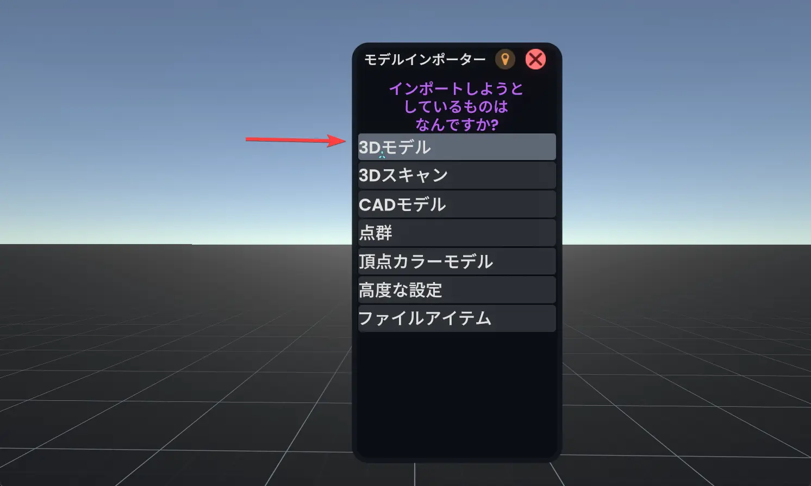
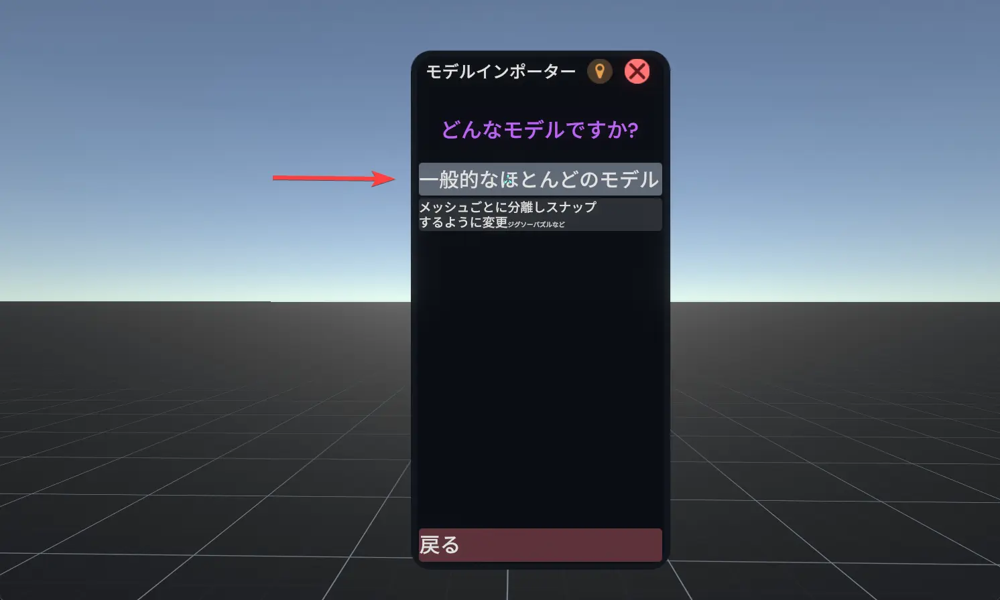
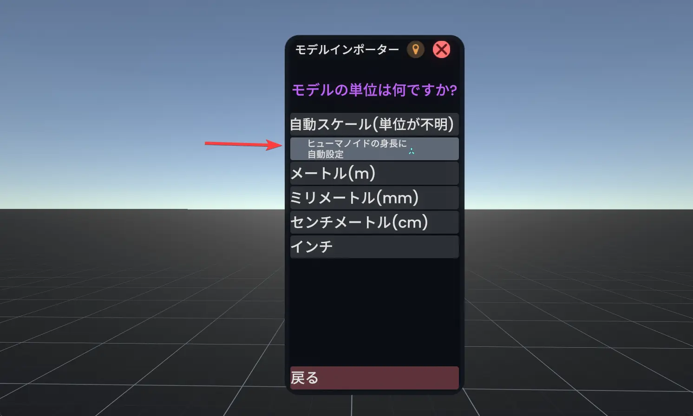
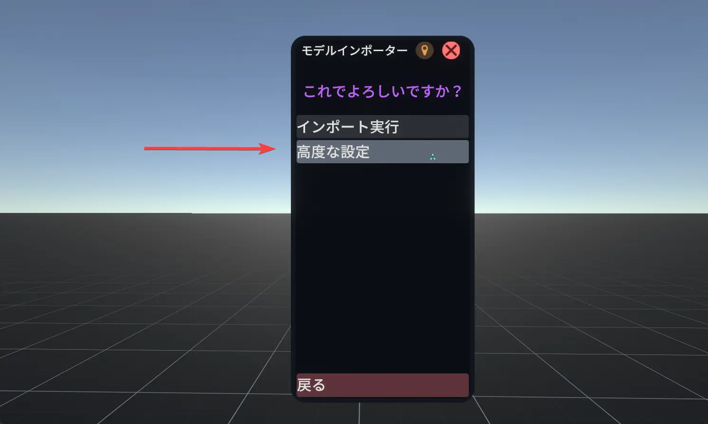

### 1.3. 高度な設定
高度な設定を開くと、画像のようなパネルが出てきます。
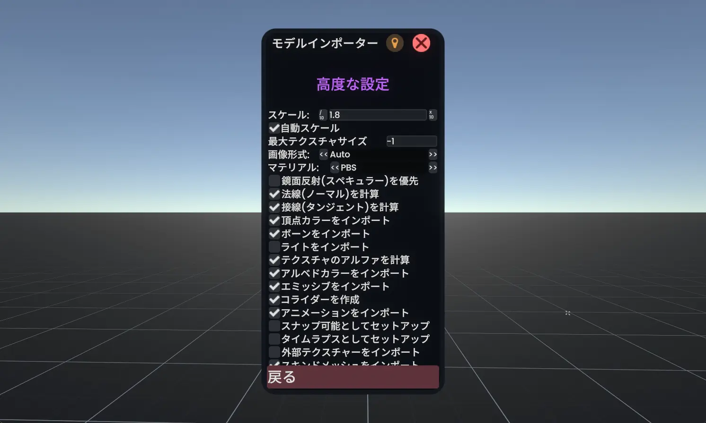
見た目をいいかんじにしたり、作業をやりやすくするためにいくつかの設定を変更します。

#### 1. `マテリアル`をPBSから`XiexeToon`に変更（`<<`を３回クリック）
- アニメ調のアバターはこれにしてください。
  - 今のところResoniteではカスタムアバターを使うことができないので、lilToon等を導入することはできません。

#### 2. `アセットをオブジェクト内に入れる`にチェック☑を入れる
- 設定項目のうち一番下にあります。
- 後からマテリアルの編集をやりやすくするための設定です。
### 1.4. インポート実行
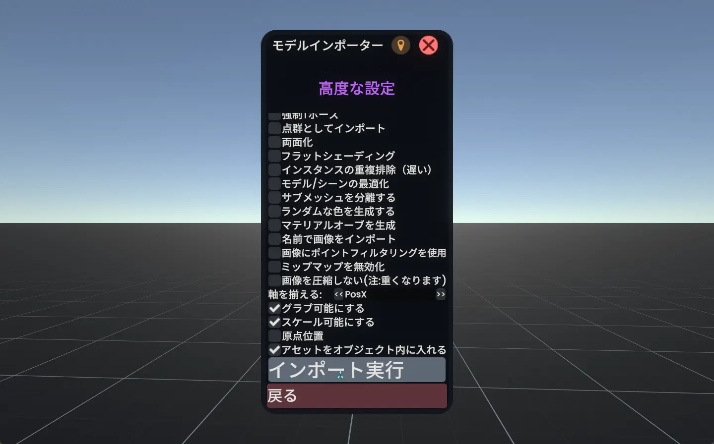
インポート実行をクリックすると、インポートが始まります。

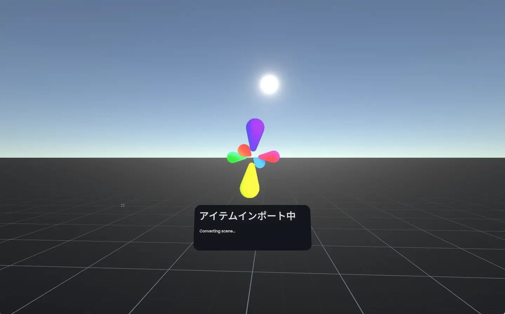
*fbxやglbなど、3Dモデルの読み込み中はこのようなダイアログが表示されます。*

インポートが終了すると、アバターが出現します。
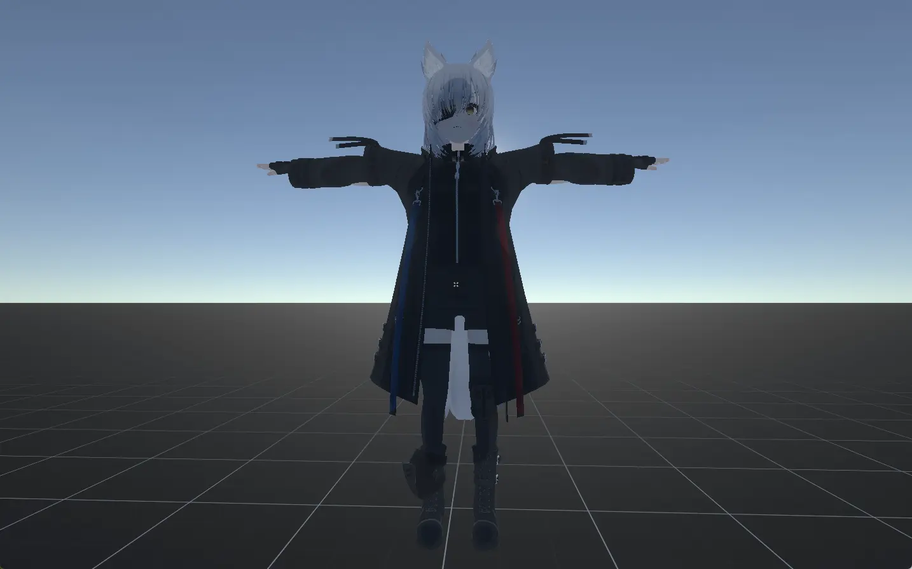
*インポートしたもの。この時点ではまだアバターではなく単なる3Dモデルのままです。*

- アバターに影がついている
- アバターがでかい
- 服が腕に追従していない
  - ConstraintはUnityの機能なので、Resoniteでは使えません。手動で対応します。

などは、今の時点でスルーして大丈夫です。後で直します。
>[!warning] アバターを掴んで動かさないで！
> fbx（glb）からインポートしたデータはアバターではなく、ボーン入りの3Dモデルとして読み込まれます。 
> この時にうっかり**アバターを掴んで動かしてしまうと、アバターの姿勢が歪んでしまいます**。 
> こうなった時はコンテキストメニューから**操作を巻き戻しましょう**。
> 

>[!note]- fbxファイルは「アバター」としてResoniteにインポートできない
> 残念ながら、VRChatアバターのfbxファイルを「アバター」のままResoniteにもってくることは今のところできません。
>
> ResonitePackage形式のファイルは、Resoniteのオブジェクト（アバター含む）としてそのままインポートできます。
## 2. インポートした3Dモデルをアバターにする
3Dモデルをアバターにする時は、**アバタークリエイター**を使います。
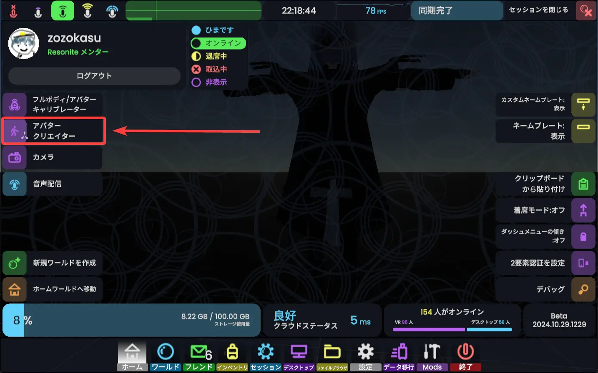

## 3. アバターにテクスチャを入れる（必要に応じて）
## 4. 表情設定
## 5. 細かい不具合の調整