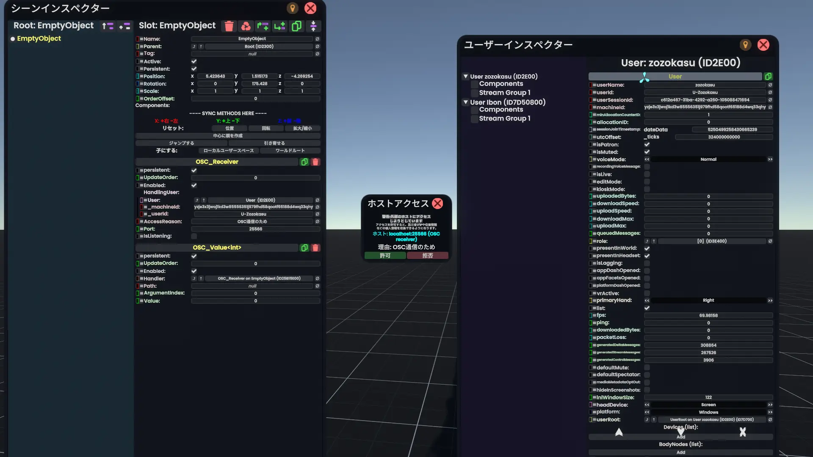
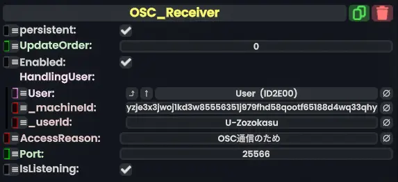
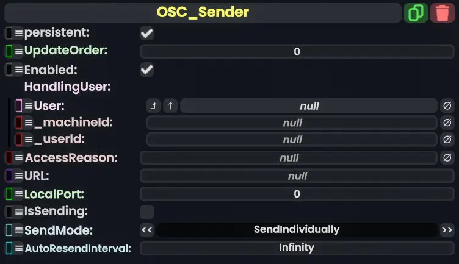
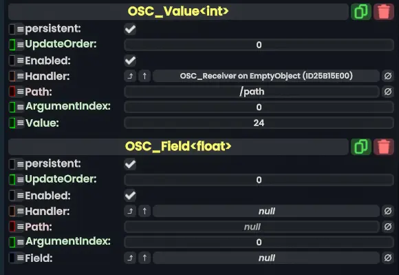

### 想定読者
- Resoniteの操作が一通りできる
- DevToolの使い方も一通りわかる
- コンポーネントをアタッチすることができる
- OSCが通信プロトコルの一種であることを知っている
- 「外のアプリからOSCを使ってResoniteに情報を送ったりその逆ができる」みたいな理解がある

### OSCを使ってアバターの表情を動かす
- [こちら(フェイストラッキング)](./facetracking.md)を参照してください。

## ResoniteのOSC
ResoniteではOSC(OpenSoundControl)と呼ばれるプロトコルを使って外部と通信することができます。

送受信をする際にイベントを発火する必要は無く（エンジンアップデートの度に送信したり、受信したものを更新してくれます）、シンプルな値の送受信や表示であればスクリプトを書かずに実装できます。
## 使うコンポーネント
#### OSC_Receiver
`Network > OSC > OSC_Receiver`
- 何かしらのソフトウェアや機器から送られたOSCによる信号を受信するコンポーネントです。
  - 何かしらのソフトや機器はOSC_ReceiverにOSCの通信を送ると言えます。
- 基本的に裏で動くタイプのコンポーネントで、実際に値を読み取るにはOSC_ValueまたはOSC_Fieldを使う必要があります。
#### OSC_Sender
`Network > OSC > OSC_Sender`
- 指定したアドレス・ポート宛てに、OSCでデータを送るためのコンポーネントです。OSC_Receiverの逆のはたらきをします。
- OSC_Receiverと同じく、実際に値を書き込むにはOSC_ValueまたはOSC_Fieldを使う必要があります。
#### OSC_Value
`Network > OSC > OSC_Value`
- `Handler`に指定したOSC_ReceiverまたはSenderに、`Path`で指定したパスで、`Value`で設定したデータを受信してもらったり送信してもらったりするコンポーネントです。
- `Handler`にOSC_Receiverを指定すると、受信しかできません。
- `Handler`にOSC_Senderを指定すると、書き込んだ値が送信されます。
#### OSC_Field
`Network > OSC > OSC_Field`
- `Handler`に指定したOSC_ReceiverまたはSenderに、`Path`で指定したパスで、`Field`で設定したフィールドにあるデータを受信してもらったり送信してもらったりするコンポーネントです。
#### その他のコンポーネント
この記事では詳しい使い方の解説はしませんが、受信したデータを何かしらの形で表示したいときに使える便利なコンポーネントがあります。（Protofluxでもできますが。）
  - ValueCopy（`Transform > Drivers`）
    - OSC_Valueにある受信データを他の場所に書き込んだり、または他のデータをOSC_Valueにコピーしてデータを送信することができます。
  - MultiValueTextFormatDriver（`Utility`）
    - Sourceに指定したフィールドにあるテキストをFormatで指定したフォーマットで、Textで指定したstring型のフィールドに書き込んでくれます。
  - ValueGradientDriver（`Transform > Drivers`）
     - いくつか設定した値の間を、Progress（float型）に応じてなめらかに遷移させることができます。
> [!info]- ValueとFieldの違い
> OSC_Valueはコンポーネント自体が値を持ち、その値を読み取ったり操作したりするものですが、OSC_Fieldは別の場所にある値を書き込んだり、読み取ったりします（プログラミングの文脈でよく『参照渡し』と呼ばれるものみたいなことです）。
> 
> 

## OSCデータを送受信する
### 要約
`OSC_Value`または`OSC_Field`のHandlerフィールドに、どの`OSC_Receiver`または`OSC_Sender`を使うかを指定します。どちらをHandlerにするかで挙動が変わります。

- `OSC_Receiver`をHandlerに指定した場合
  - 指定したパスの値の変化を受信したとき、OSC_ValueのValueもしくはOSC_Fieldで指定したフィールドに**値が書き込まれます**。

- `OSC_Sender`をHandlerに指定した場合
  - OSC_ValueのValueまたはOSC_Fieldで指定したフィールドの値が更新されたとき、OSC_Senderに設定したアドレス・ポート宛てに、指定したパスのものとして**値が送信されます**。

### OSC_Receiverの使い方

1. `Network > OSC > OSC_Receiver`をつけたいオブジェクトにアタッチ。
2. 『Port』にOSC通信で使用するポート番号を入力してください。
   - 『AccessReason』は、通信したときに表示されるダイアログ（小さい画面）に理由を表示するものです。
3. 『HandlingUser』に、通信するUserを指定してください。
   - Userは、ユーザーインスペクター（DevToolを装備して`新規作成 -> エディター -> ユーザーインスペクター`）を開き、ユーザーインスペクター左側からユーザーを選択し、一番上に表示される`User`コンポーネントっぽいものをOSC_ReceiverのUserフィールドに設定することで指定できます。
   - または、ProtoFluxで書き込む（実用的です）。

### OSC_Senderの使い方

1. `Network > OSC > OSC_Sender`をつけたいオブジェクトにアタッチ。
2. 『URL』に送信先のアドレスを指定してください。
3. 『LocalPort』に送信先のポート番号を指定してください。
4. 『HandlingUser』に、通信すUserを指定してください。

### OSC_Value（Field）の設定

1. `Network > OSC`内にある`OSC_Value(Field)<T>`をアタッチ
   - `OSC_Value<T>`をクリックすると型リストが!表示されるので、その中から選択してください。

2. `OSC_Value(Field)`の『Handler』に、`OSC_Receiver`または`OSC_Sender`を指定します。
3. `OSC_Value(Field)`の『Path』に、送受信する値のパスを指定します。