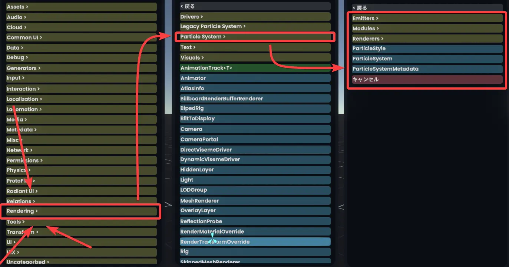
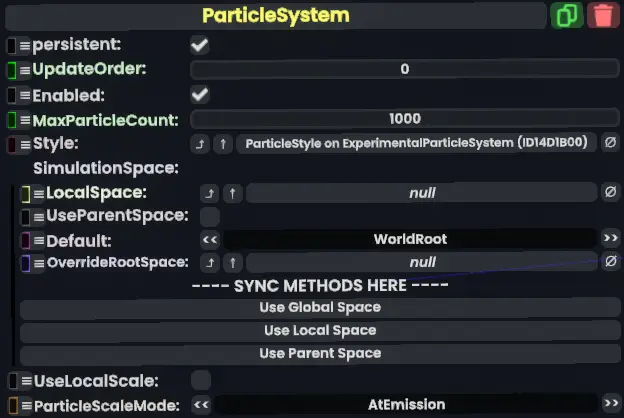
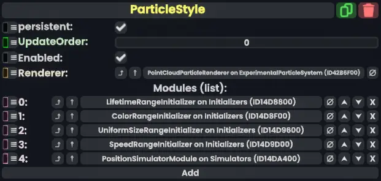

## Resonite 独自のパーティクルシステム Photon Dust
**Photon Dust**とは、Resoniteで使われるパーティクルシステムです。  
もう少し丁寧な言い方をすると**パーティクルの見た目・動き等を制御をするシステム**と言えます。

Photon Dustの特徴として
- 処理が描画とは独立して（**非同期で**）行われる
  - 例えば大量のパーティクルを出しても画面全体のフレームレートは下がらず、パーティクルの動きだけがカクカクになります。
- パーティクルの性質を決定づける**Module（モジュール）**、これを足し合わせてパーティクルを制御する。
- FrooxEngine・Protofluxと容易に接続できる。
  - モジュールの値をProtofluxや他のコンポーネントから（つまり、何からでも）制御できます。
## Photon Dustの構成要素
Photon Dustでパーティクルをつくるために必要なコンポーネントです。大きく分けて5種類あります。

いずれも`Rendering > Particle System`内にあります。

### Emitter（エミッター）
パーティクルを発生させる場所です。  頻度（時間あたりに出てくる数）も設定できます。

#### 主なEmitter
| 名前 | 説明                        |
| --- |---------------------------|
| Point Emitter | 一点からパーティクルを発生させる          |
| Box Emitter | 立方体の面上、または中からパーティクルを発生させる |
| Sphere Emitter | 球の面上、または中からパーティクルを発生させる   |
| Line Emitter | 線の上からパーティクルを発生させる         |

### Particle System（パーティクルシステム）

パーティクルの中心部分です。どのパーティクルスタイルを使うか、どのオブジェクトの下でパーティクルを動かすか、最大パーティクル数などを設定します。

システム的には重要な部分ですが、見た目に関する機能はそこまでありません。

### Particle Style（パーティクルスタイル）

モジュールを組み合わせて最終的なパーティクルの動き・見た目を決定します。

### Module（モジュール）
パーティクルの動きや見た目を制御します。

複数のModule を Particle Style に割り当てることで、パーティクルの動き・見た目を設定できます。

詳しくは[Moduleのページ](./module.md)を参照してください。
### Renderer（レンダラー）
パーティクルの見た目を決定します。
| 名前 | 簡単な説明                        |
| --- |---------------------------|
|BillboardParticleRenderer| パーティクルとして、主にテクスチャを描画します。|
|MeshParticleRenderer| パーティクルとして、3Dモデルを描画します。|
|PointCloudParticleRenderer| パーティクルとして、1ピクセルの点を描画します。|
## 作例
