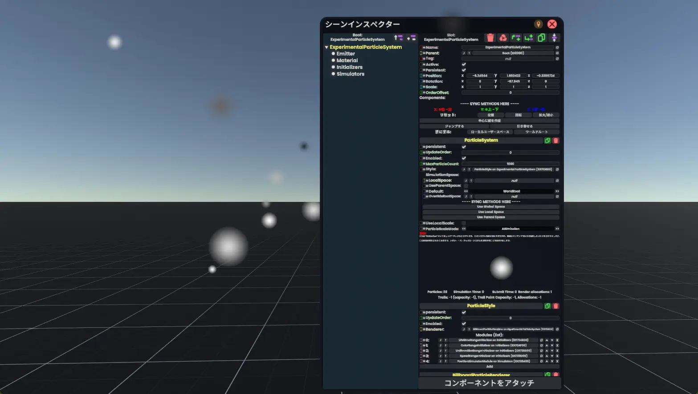
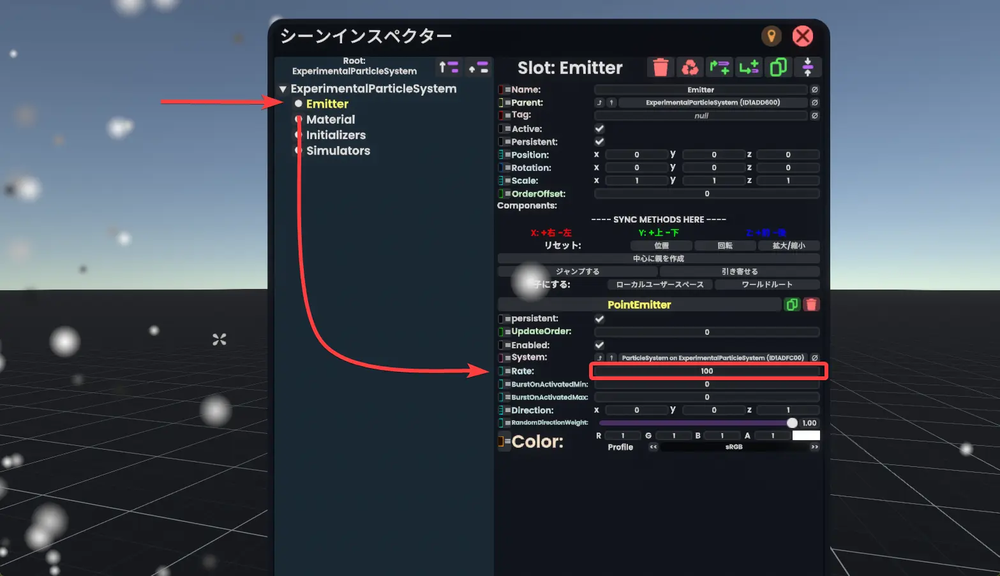
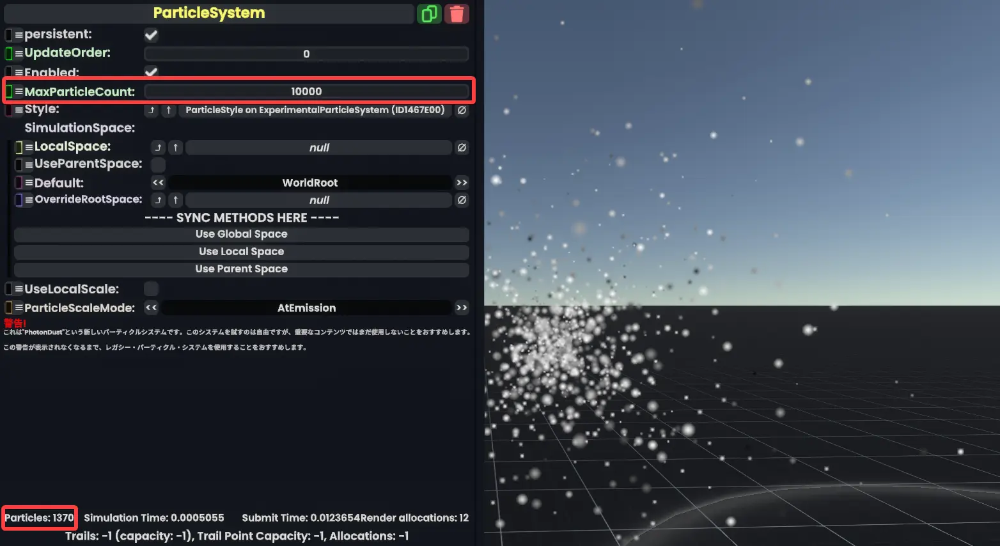
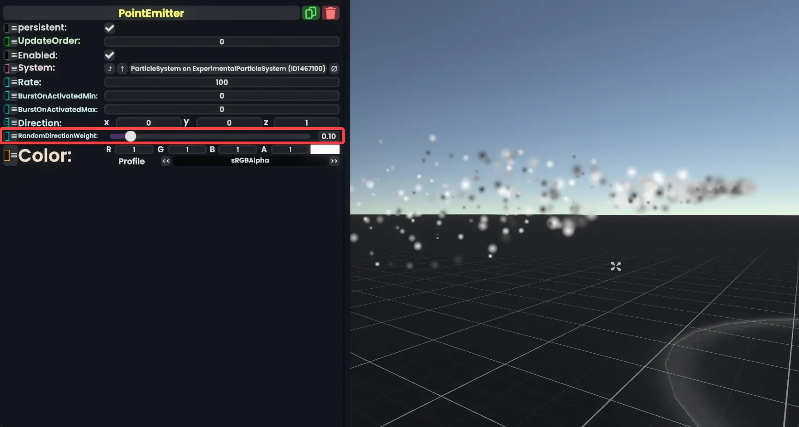
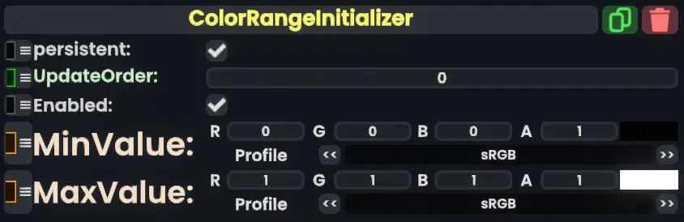
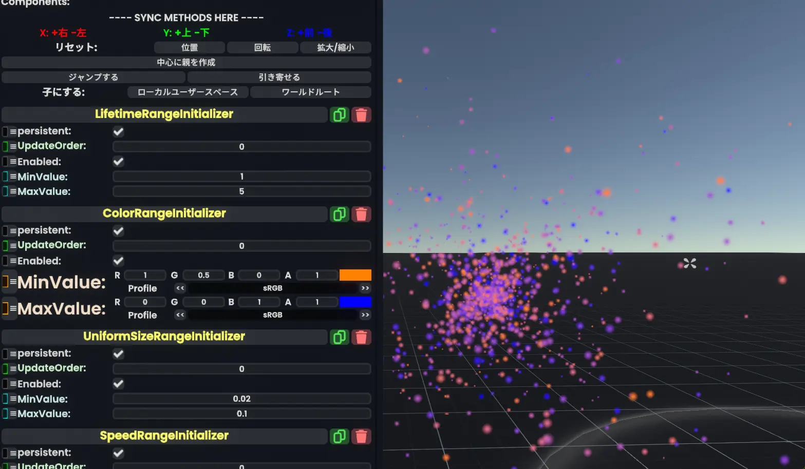

# サンプルの中身を見る
## サンプルパーティクルの作成
テンプレートそして作成できるパーティクルシステムをいじりながらパーティクルを作ってみましょう。

[Dev Tool](../tool-usage/devTool.md)の`新規作成`から**Particle System**を選択してください。
>[!note]
> 画像予定

このようなサンプルのパーティクルが出現します。

このパーティクルにはつぶつぶを飛ばすためだけの最低限の機能がついています。

Slotの構造は以下のようになっています。
- ParticleSystem
  - Emitter
  - Material
  - Initializers
  - Simulators
### それぞれのSlotのなかみ
長いので飛ばしても大丈夫です。
#### _ParticleSystem_ の中身
3つのコンポーネント、`ParticleSystem`、`ParticleStyle`、`BillboardParticleRenderer`がくっついています。

> [!abstract]- **ParticleSystem**（パーティクルシステム）
> パーティクルの基本設定をするコンポーネントです。設定できる内容は
> - どのParticleStyleを使うか
> - どの場所（Slot）を基準にするか
> - パーティクルは最大でどのくらいの数にするか
> - など
    > があります。

> [!abstract]- **ParticleStyle**（パーティクルスタイル）
> 1つのParticleRenderer（パーティクルレンダラー）と、複数のModule（モジュール）をもとにパーティクルの見た目や動きを決定します。
>
> 「いくつかのモジュールを組み合わせてParticle Styleをつくる」とも言い換えできます。

> [!abstract ]- **BillboardParticleRenderer**（ビルボードパーティクルレンダラー）
> パーティクルを2Dの画像として描画するようにするコンポーネントです。
#### *Emitter* の中身
`Point Emitter`コンポーネントのみが入っています。
> [!abstract]- **Point Emitter**（ポイントエミッター）
> Slotがいる点からパーティクルを発生させるエミッターです。
> - どのくらいの頻度でパーティクルを出すか
> - どのParticleSystemを使うか
> - コンポーネントが有効化した（EnabledがTrueになった）ときにどのくらいのパーティクルをドバっと出すか（Burst）。その最小値と最大値。
> - パーティクルを放つ向き
> - パーティクルの色
> などを設定できます。
#### _Material_ の中身
`UnlitMaterial`と`StaticTexture2D`コンポーネントが入っています。
> [!abstract]- **UnlitMaterial**（アンリットマテリアル）
> 色やテクスチャをもとに色や質感を決定づける、マテリアルの一種のコンポーネントです。
> 
> Material（マテリアル）と呼ばれるコンポーネントは、パーティクルに限らず、3Dオブジェクトの見た目を設定するためにも使われます。
> Materialにはいくつか種類はありますが、このUnlitMaterialの場合、影や光沢がないため、基本的にテクスチャや色の設定値そのままの色が画面に表示される、などの特徴があります。

> [!abstract]- **StaticTexture2D**（スタティックテクスチャ2D）
> テクスチャ、つまり画像です。
> 上のUnlitMaterialのコンポーネントでこのコンポーネントが読み込まれています。
> 
> 画像のURLをコンポーネントの`URL`の欄（フィールドとも言います）に入れることで、その画像をテクスチャとして使うことができます。
> 設定項目がそれなりに多いのでコレ以上の説明はしません。

#### _Initializers_ の中身
ParticleStyleで使われるModuleコンポーネントのうち、**Initializer**（パーティクルの初期パラメータを決めるもの）として使われる、`LifetimeRangeInitializer`、`ColorRangeInitializer`、`UniformSizeRangeInitializer`、`SpeedRangeInitializer`が入っています。

> [!abstract]- **LifetimeRangeInitializer**（ライフタイムレンジイニシャライザー）
> パーティクルの寿命を決めるコンポーネントです。
> 
> Range（範囲）という名前の通り、パーティクルの寿命を最小値と最大値の範囲で設定できます。

> [!abstract]- **ColorRangeInitializer**（カラーレンジイニシャライザー）
> パーティクルの色を決めるコンポーネントです。
> 
> パーティクルの色がMinValueとMaxValueの間のランダムな色になります。

> [!abstract]- **UniformSizeRangeInitializer**（ユニフォームサイズレンジイニシャライザー）
> パーティクルのサイズを決めるコンポーネントです。
> 
> パーティクルのサイズがMinValueとMaxValueの間のランダムなサイズになります。

> [!abstract]- **SpeedRangeInitializer**（スピードレンジイニシャライザー）
> パーティクルの速度を決めるコンポーネントです。
> 
> パーティクルの速度がMinValueとMaxValueの間のランダムな速度になります。
#### _Simulators_ の中身
ParticleStyleで使われるModuleコンポーネントのうち、**Simulator**（パーティクルの動きを計算するもの）として使われる、`PositionSimulatorModule`が入っています。

> [!abstract]- **PositionSimulatorModule**（ポジションシミュレーターモジュール）
> パーティクルの位置を計算する、つまりパーティクルを動かすモジュールです。
> 
> **このモジュールがないとパーティクルが動きません。**
> パーティクルのCollision（当たり判定とぶつかるかどうか）のオンオフもここで設定できます。

# サンプルをいじる
## パーティクルをたくさん出してみる
`Emmiter`Slotにアタッチされている**Point Emitter**の、**Rate**の値を変えることで、時間あたりにどれだけパーティクルが出てくるかを変更できます。

> [!info]- すごい大きい数字を入れてみたけど、明らかに少ない！
> 1つのParticleSystemで画面に描画できるパーティクルの数の上限が、`ParticleSystem`の**MaxParticleCount**で設定されています。
> 
> **MaxParticleCountの数字を大きくすることで、画面に表示できるパーティクルの数を増やすことができます。**
> 
> `MaxParticleCount`はデフォルトで**1000**に設定されています。このため、いくらEmitterのRateの数字を大きくしても、パーティクルは1000個より多く存在できないようになっています。
> 最大パーティクル数はParticleSystemごとに設定できます。
> 
> **ただし、画面に表示するパーティクルの数が増えると、当然処理や描画にかかる負荷も増えます。**
> 
> 
> *MaxParticleCount（上）と、現在画面に描画されているパーティクルの個数（左下）*
> 
> 画面にどれだけのパーティクルを描画すると重くなるか？の目安を以下に示します。
> |パーティクルの数（目安）|パーティクルシステムへの影響|FPSへの影響|
> |---|---|---|
> |～1,000|ほとんどない|ほとんどない|
> |10,000|人によってはパーティクルがカクつくかも|ほとんどない|
> |100,000|ほとんどの人でパーティクルがカクつく|人によっては多少FPSが下がる|
> |1,000,000|動きはするが、がたがた|ほとんどの人で5～10以上FPSが下がる（多分）|
> 
> 
> *多くのパーティクルを出すと、パーティクルの動きだけが滑らかでなくなる。パーティクルの描画より、その位置の計算の方が時間がかかるのだ。*
> 
> 負荷につながるのは「**今画面に表示されているパーティクルの個数**」なので、
> - MaxParticlesを大きくする
> 
> ことに加えて
> - EmitterのRateを上げる
> - パーティクルの寿命（Lifetime）を長くする
> 
> ことで負荷がかかります。
## まっすぐ飛ばす
`Emitters`Slotにアタッチされている**Point Emitter**の、**RandomDirectionWeight**（**ランダムディレクションウェイト**）の値を小さくすることで、パーティクルが`Direction`で指定した向きにまっすぐ飛ぶようになります。

|RandomDirectionWeightの値| パーティクルの動き                                                      |
|---|----------------------------------------------------------------|
|0| Directionで指定した方向にまっすぐ飛ぶ                                        |
|0～1| Directionの方に飛ぶが、設定値に応じて拡散する（1に近いほど拡散する。0.5より大きくすると後方にも飛ぶようになる） |
|1| ランダムな方向に飛ぶ                                                     |

*PointEmitterのRandomDirectionWeightを0.1にすると、パーティクル全体としては細長いコーンのような形をつくる*

## 色を変えてみる
`Initializers`Slotにアタッチされている**ColorRangeInitializer**の、**MinValue**と**MaxValue**の値を変えることで、パーティクルの色を変更できます。

> [!note] 色の最小・最大値？
> **MinValue**と**MaxValue**という名前になってますが、最小最大というより、**パーティクルが生まれるときに指定した範囲の中からランダムで色が選ばれる**、と考えた方がイメージしやすいかもしれません。
> 
## 遠くまで飛ばしてみる
### 速度を上げる
`Initializers`Slotにアタッチされている**SpeedRangeInitializer**の、**MinValue**と**MaxValue**の値を変えることで、パーティクルの速度を変更できます。

パーティクルが生成されるとき、パーティクルの速度はMinValueとMaxValueの間のランダムな速度に設定されます。

数字が大きいほど速くなります。
### パーティクルの寿命を伸ばす
`Initializers`Slotにアタッチされている**LifetimeRangeInitializer**の、**MinValue**と**MaxValue**の値を変えることで、パーティクルの寿命を変更できます。

パーティクルが生成されるとき、パーティクルの寿命はMinValueとMaxValueの間のランダムな値に設定されます。

数字が大きいほど長い間表示されます。

## パーティクルの大きさを変える
