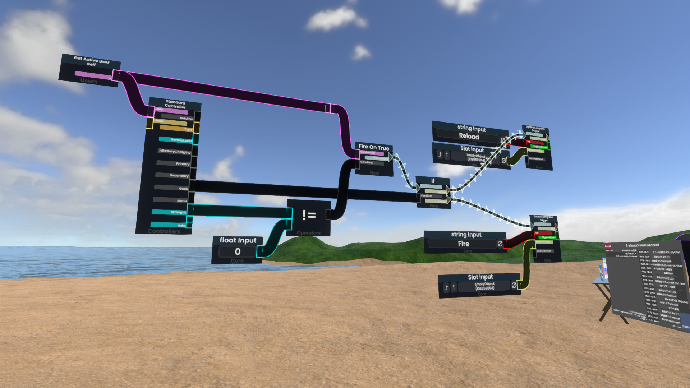

*Protofluxのロゴ*

**Protoflux**は、Resonite独自のビジュアルプログラミング言語です。

**ノード**と呼ばれるブロックを繋ぎ合わせることで、プログラムをつくります。

*Protofluxの例*

**Protofluxを利用した開発は、Resoniteの中で行います。**

公式から提供されているProtofluxの開発環境は、今のところResonite本体のみになっています。
>[!question]- 「ビジュアルプログラミング」について
> 「ビジュアルプログラミング言語」は今や数多くあり、中でも**Scratch**はひときわ有名だと思います。もしかすると、これを読んでる人の中にはScratchを使ったことがある人もいるかもしれません。
> しかしながら、ProtofluxはScratchとは異なる部分があります 
> どちらも「値や処理の流れを直感的にわかりやすい形で表現する」という点では同じですが、Scratchが何かしらの処理をするブロックを直接積み重ねたり、条件ブロックで囲うことでプログラムを表現しますが、Protofluxはノード同士を線でつなぐことでプログラムを表現します。 

## ProtoFluxの役割
Protofluxは、Resoniteで複雑なロジックを実装するためのビジュアルプログラミング言語です。

いくつかの面白い特徴があります。ストアページの文言を引用しながら説明します。
### ProtoFlux
> ProtoFluxは、私達の作ったクリエイティブツールの最高傑作(crown jewel)であり、経験豊富なチームがこれまでに設計した中で最も優れたビジュアルプログラミング言語です。
> 
> シンプルなインタラクションから複雑なゲームやシステムまで、あらゆるアイデアを容易に形にでき、本格的な制作まで行うことができます。
> さらに、リアルタイムで複数人での共同作業ができるほか、プログラムの変更が即座に反映される機能もあります。

ProtoFluxはリアルタイムでプログラムが反映され、複数人での共同が容易にできます。（ProtoFluxというよりはResonite（FrooxEngine）の機能と言った方が正しいかもしれませんが……。）

複数人で作業ができると言うのは、複数人で同時にノードをバシバシ組んでいく、というより、実際には、例えば複雑なゲームワールドやアイテムを作っているセッションの中で、「あの人はここのロジックを組んでて、別の人はまた別の箇所の修正をしている。ヘルプを呼んだら誰かが文字通り駆けつけて、直す」みたいなことができる、といった感じの方が近いと思います。

### 全てを制御できるスクリプト（Script anything）
> ProtoFluxがアクセスできるものは、全て。──ワールド、アイテム、アバター、そしてそれらを組み合わせたありとあらゆるものまで！

Resoniteには、インスペクターからアクセスできるあらゆるのデータを読み取ったり書き込んだりできる仕組みがあるほか、変化し続ける値の計算をリアルタイムに反映させる**Drive（ドライブ）** の仕組みがあります。

これらの機能はResoniteのコンポーネントだけでなく、ProtoFluxでも扱うことができます。

例えば、音楽に合わせて回るミラーボールを作ったり、ユーザーの人数に応じて部屋の広さを変えたり、天使の輪っかをクリックすると光るようにしたり……。

### Websocket
> ResoniteにはWebSocket機能が標準で搭載されています。このため、外部のアプリケーションと簡単に通信できます。独自のゲームサーバーを構築したり、外部データを取得したり、自作のハードウェアと連携したり、Resoniteの機能に頼らない幅広い機能を実現できます。

Resoniteには**WebSocket**や**OSC**プロトコルを通じて外部のサーバーとやりとりする機能が搭載されているほか、ProtoFluxにはWebSocketイベントを受け取る機能や**HTTP GET/POST**リクエストを送信する機能があります（もちろんレスポンスを受け取れます）。

### 非同期処理
> ProtoFluxでは、処理を一次停止したり、フレームを跨いで待機するような処理も標準機能で実装できます。非同期処理実行時のスコープが保存されるため、同じコードで複数回、非同期処理を呼び出しても、呼び出しそれぞれが独立したコンテキストを持って動作します。複雑なロジックもシンプルかつ柔軟に実装できる、非常に強力なツールになっています。

ProtoFluxで『同期的な処理』は、呼び出した一連の処理を1フレームの中で終えられるようなものを言います。逆に、時間のかかる処理はすべて非同期（async）なものになります。

非同期処理を呼び出すと、コンテキストやスコープといったものが独立して保存されるため、時間のかかる処理、例えば複数のサイトに一度にアクセスしてその結果をそれぞれ表示する、のような処理を一度に複数回呼び出すといったことができます。

### 柔軟性のあるストレージシステム
> Local、Store、Data model。用途やスコープに合わせてデータの保存形式を選択でき、効率的で最適なシステム構築が可能になります。

ProtoFluxの中で変数を定義することができます。
####  Data model 
Resonite全体で「グローバル」な変数です。ProtoFluxの実行コンテキストを跨いで値が保存される（FrooxEngineが値の保持をしている）ほか、全てのユーザーに変更が反映される変数です。

**プログラミング初心者にとっては一番取っつきやすい**変数です。 要するに、値を書き込んだら、その通りになります。

#### Store
複数のコンテキストを跨いで値を保存する変数です。ProtoFluxの実行コンテキストを跨いで値が保存されますが、全てのユーザーに変更が反映されるわけではありません。

#### Local
いわゆるローカル変数です。実行コンテキストで独立した値を持つため、特に非同期フローで真価を発揮します。

## アイデアを形にするために
ビジュアルプログラミング言語は、プログラミングをやったことのない人でも比較的簡単にロジックを組めるように作られています。

特にResoniteは特別な環境構築をせずともゲーム内で即座にプログラミングができるため、考えたことをその場で形にすることが簡単にできます。

しかしながら、結局のところはプログラミングです。「乗ると上にはねるジャンプ台」を作るだけでも「『ジャンプ台』はどれか」「誰かが『ジャンプ台』に触れたらこの処理を実行する」「『ジャンプ台』に乗ったのは誰か」「乗った誰かをどのくらいの勢いで飛ばすか」といったことを考える必要があります。

でも、安心してください。文字で書くと難解でロジカルな感じになりますが、ビジュアルプログラミングではかなり直感的なコーディングができます。

本当にロジカルに厳密にしなければならない部分は、ProtoFluxそのものを動かしている難解なコードが全部やってくれますし、多少のエラーはProtoFluxが全部良い感じに覆い隠してくれます。（例えば、型が対応してないとノードがつながらないようになっているので不正な型変換が原理的に発生しない、など）

ここまで言うといかにもお膳立てされた、子供向けっぽい、という感じがしますが、きちんと**高度なこと**ができる機能も用意されています。

>[!info]- 高度なことの例（アバターミーツ）
> <iframe width="500" height="300" src="https://www.youtube.com/embed/8XpzJX_nhIY" title="VRと現実を繋ぐ！魔法の扉『AVATAR MEETS』 at Vket Real" frameborder="0" allow="accelerometer; autoplay; clipboard-write; encrypted-media; gyroscope; picture-in-picture; web-share" referrerpolicy="strict-origin-when-cross-origin" allowfullscreen></iframe>
>
> [制作者のブログ](https://gammalab.net/works/avatarmeets/)によると、複数台のAzureKinnect（深度カメラ）の映像をもとに推定した姿勢の情報をResoniteに送信して、3Dアバターの姿勢を制御しているようです。

>[!info]- 高度なことの例その2（Metaverse Makers Competition）
> <https://wiki.resonite.com/MMC_2025>
> 
> Resonite内で開催される、ワールドやアイテムを作るコンテストです。いくつか部門があり、入賞者には賞金が出ます。筆者も入賞しました。

このように、Resonite自体がもつ基盤システムとProtoFluxの機能を組み合わせることで、容易にかつ高度にインタラクティブなコンテンツを作ることができます。

さて、ここからは実際にProtoFluxを使って何かをつくってみましょう。プログラミングの楽しさや、ProtoFluxに限らずプログラミングの幅広い分野で使われるような概念も学ぶことができるかもしれません。