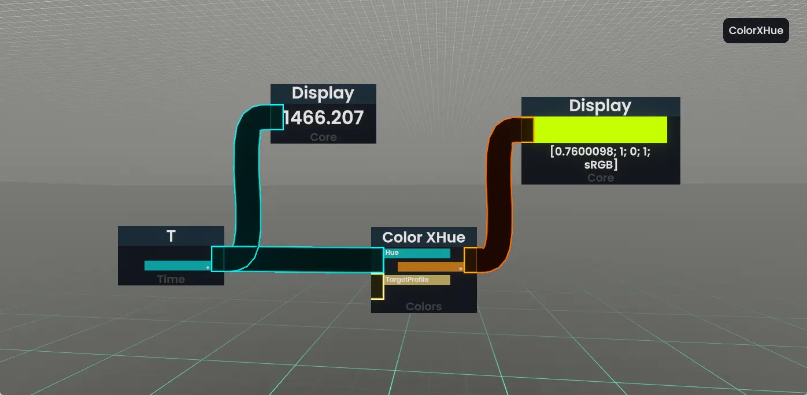

ProtoFluxの書き方がわかったところで、最初のProtoFluxを作ってみましょう。

> [!info]- 数字キーでツールを切り替えられる
> デスクトップモードでは、それぞれの数字キーにツールが割り当てられています。
> |数字キー| ツール|
> |:--:|:--:|
> |1|**装備解除**|
> |2|[**Devツール**](../../tool-usage/devTool.md)|
> |3|**ProtoFluxツール**|
> |4|Material ツール|
> |5|Shape ツール|
> |6|Light ツール|
> |7|Grabbable Setter ツール|
> |8| Physical Collider ツール|
> |9|マイク|
> |0|グルーツール|
> 
> この記事では1～3のツールを使います。デスクトップモードの方は数字キーを押してツールを持ち替えてください。

Resoniteではどういうわけか、一番最初に作るアイテムとして「虹色に光るボックス」が伝統的に選ばれています。

シンプルなProtoFluxを書きながら、ProtoFluxツールやDevツールを実際に操作してみましょう。
## ボックスを作る

> [!abstract]- 事前に用意したボックスがこちらです
> この手順はDevToolやインスペクターの操作を学ぶチュートリアルですが、いきなりマテリアルとかコンポーネントとか言われても大変だと思うので、事前にボックスだけ作ったものを用意しました。
> 
> 以下のファイルをダウンロードして、**Resoniteの画面にドラッグアンドドロップ**すると、箱が目の前に出てきます。
> 
> [ProtoFluxを書く](easy-protoflux.md#protofluxを書く)までスキップできます。
> - [Box - チュートリアル用.resonitepackage](../../image/protoflux-tutorial/Box%20-%20チュートリアル用.resonitepackage)

DevToolを装備してコンテキストメニューを開き、**新規作成**を選んで出てくるウィンドウから、`3Dモデル > ボックス`を選択しましょう。ボックスが目の前に出現します。

少し大きいのでボックスを小さくしましょう。

1. ボックスを**選択**して**インスペクター**を開く 
   > オブジェクトの選択は、DevToolのレーザーをボックスの方に向けて（デスクトップモードの場合はボックスの方を向いて）**セカンダリ**を押すことでできます。
   - 選択されたオブジェクトの中心には**ギズモ**が現れ、またオブジェクトをすっぽり囲うように水色の破線で**バウンディングボックス**が表示されます。
   > オブジェクトのインスペクターは、オブジェクトを選択した状態でコンテキストメニューから「**インスペクターを開く**」を選択することで開けます。
2. インスペクター右側にある**BoxMesh**コンポーネントの**Scale**を`0.2 0.2 0.2`に変更する。

これで小さいボックスができました。

### ボックスのマテリアルを変更する
新しくマテリアルを作成して、ボックスに適用します。
> [!question]- マテリアルのはなし
> Resoniteに限らず多くのゲームエンジンでは、オブジェクトを描画するために形状データである**メッシュデータ**と、色や質感を決める**マテリアルデータ**を組み合わせて描画します。
> 
> 新規作成から作られる3Dモデルのマテリアルはワールド内で共通のものになっています。このため、作ったボックスの色をそのまま変えてしまうと後から作る3Dモデルの色も変わってしまいますし、アイテムとして保存したときにProtoFluxが正しく動作しなくなります（参照がアイテムの外にあるため）。
> そのため、ボックスの中にマテリアルを新しく作成して適用する必要があるのです。

1. ボックスのインスペクターを開き、コンポーネント一覧一番下にある「**コンポーネントをアタッチ**」をクリックします。
2. `Assets > Materials > PBS_Metallic`を選択します。
3. PBS_Metallicを「掴んで」、

## ProtoFluxを書く
いよいよProtoFluxを書いていきます！

### 色の変化をつくる
始めのほうで「『虹色に光るボックス』を作ります」と言いましたが、もう少し丁寧に言うと「色がめまぐるしく変化し続けるボックス」、もっと丁寧に言うと「色相が変化し続けるボックス」を作ります。

**手順**
1. ノードブラウザから`Time > WorldTimeFloat`を選択して配置します。
2. 同じように `Color > ColorXHue`を選択して配置します。
3. Timeノードの出力をColorXHueノードの<u>**同じ色</u>の方の入力**に接続します。

ここで、WorldTimeFloat（以下Time）ノードとColorXHueノードの出力を見てみましょう。

_ProtoFluxの2つのノードそれぞれの出力を表示している_

> [!info] ディスプレイノードで出力を確認する
> ノードの出力からワイヤーを引っ張り出しながらセカンダリーを入力するとディスプレイノードが出現します。

TimeノードやColorXHueから生やしたディスプレイノードが目まぐるしく変化しているのがわかると思います。

ProtoFluxは**値の変化がリアルタイムで反映されます**！この機能はテストやデバッグ（バグの修正）に非常に便利です！一般的なプログラミング言語では、値の変化を追跡するために要所要所にprint文を入れたりしますが、ProtoFluxでも同じようにしてディスプレイノードを生やして、その時点での値がどうなっているのかを確認できるのです。

- Timeノードは、セッションが始まってから何秒経ったかの数字を出力するノードです。
- ColorXHueノードは、入力された色相をもとに色を出力するノードです。
> [!question]- 色相とは
> **色相**は、色の明るさや濃さとは異なる概念で、色の「種類」を表すものです。色相は、色の三属性（色相、明度、彩度）の一つであり、色を分類するための重要な要素です。
>
> ColorXHueノードは、入力された色相をもとに色を出力します。色相は、0から1の範囲で指定できます。0から入力を徐々に大きくしていくと、0.0は赤、0.33は緑、0.66は青、1.0で再び赤を出力し、さらに数字を大きくしていくと**色が全く同じように循環します**。

値の種類の事を「**型（Type）**」と言います。ProtoFluxではノードやワイヤーが出力・伝達する値が**どのような型であるかを色や模様で区別できます**。また、**対応した型であればどのノードからどのノードにも接続できます**。

WorldTimeFloatノードは、セッションの経過時間を**float**型のデータとして出力し、ColorXHueノードは、**float**型で入力された色相をもとに**colorX**型のデータを出力します。

float型とcolorX型はResoniteの様々な場所で使われる典型的な型です。
> float型は、**実数**を表す型です。整数や小数を表現できます。
> 
> colorX型は、**色**を表す型です。RGBA（赤、緑、青、不透明度）の値を0~1の範囲で指定でき、またカラープロファイルを設定できます。

### ボックスの色にドライブする
ProtoFluxの出力をボックスの色に書き込みましょう。

ここでは、オブジェクトに値を書き込む方法として**Drive（ドライブ）** を使います。
ボックスの中にある`PBS_Metallic`コンポーネントの`EmissiveColor`の部分を、ProtoFluxでDriveします。

1. **ProtoFluxツールを装備して**、PBS_MetallicコンポーネントのEmissiveColorの部分を掴んでください。ツールの先端に「EmissiveColor(ID123456)」のような表示が出ます。
2. 掴んだままコンテキストメニューを開いて、Driveを選択します。
3. 出てきた**Driveノード**の入力に、ColorXHueノードの出力を接続します。

> PBS_Metallicのようにオブジェクトの色や質感を決めるコンポーネントを、まとめて**マテリアル**と呼びます。ResoniteにはPBS_Metallicの他に、UnlitMaterial（影がないのっぺりとしたマテリアル）やFresnelMaterial（画面に対する角度に応じて色が変化する）などのマテリアルがあります。

ここまでできたら上の動画のように虹色に光るボックスができたと思います。次はこのProtoFluxをボックスにしまいましょう。

## パッキングする
ProtoFluxをオブジェクトの中にしまいこむことを**パッキング**と呼びます。

### 手順
1. Devツールを装備し、ボックスのインスペクターを開く。
2. ProtoFluxツールを装備し、パッキングしたいノードに向かってセカンダリを長押しする。
   - つながっているノードが全て選択されて、ノードが青っぽくなります
3. ProtoFluxツールを装備したまま、インスペクター上のボックスSlotをグラブする。
   - Slotをグラブすると手のあたりに『Slot名(ID12345600)』のような表示が出ます
4. <u>グラブしたままコンテキストメニューを開き</u>、「○○にパッキング」をクリックします

パッキングができたら**完成！**
> [!abstract] Slot（スロット）
> Resonite内のオブジェクトの基本単位を**Slot（スロット）**と呼びます。**インスペクターの左側に並んでいるやつ**です。UnityでいうGameObjectに相当するものです。
> 
> Slotは**位置（Position）**や**姿勢（Rotation）**、**大きさ（Scale）**、**名前**などのパラメータを持ちます。実は見た目を持たないので、Slotにそれ用のコンポーネントをアタッチすることで見た目（MeshRenderer等）や当たり判定（各種Collider）を持たせています。このあたりはUnityと似ています。
>
> Resoniteの世界は**全て(一切誇張なく、文字通り全て！)** Slotの組み合わせでできています。もし気になったらDevツールでワールド全体（Root以下）のヒエラルキーを見てみると、いろいろ見えてくるかもしれません。

できあがったものは**インベントリに保存**しましょう。インベントリから取り出したあとも動作しているはずです。

シンプルながら、**ギミック付きのアイテムを作ることができた**ということになります！おめでとう！

## まとめ
さて、虹色に光るボックスを作りながら

- ProtoFluxツール・Devツールの使い方
- Resoniteのオブジェクトがもつ値へのDrive
- ProtoFluxのパッキングの仕方

これらのこと、つまりギミックのあるアイテムを作って完成させる術を学びました。

必要な事とはいえ全体的につまらない章だったと思います。ですが完成品は完成品です。インベントリに保存できるならResonitePackageとして配布することだってできるのですから！

次の章ではもう少し面白く「ジャンプ台」を作りながら、Resoniteの機能をつかった実践的なギミックを作っていきます。

もし、プログラミングやProtoFluxのいろいろな機能、記法を知りたい方は一つ飛ばして次の次の章から読み進めてもいいかもしれません。