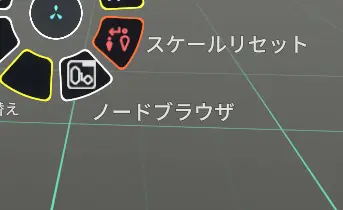
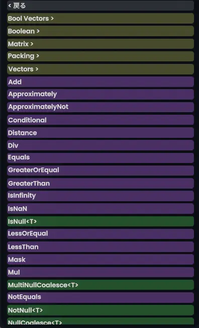
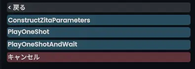
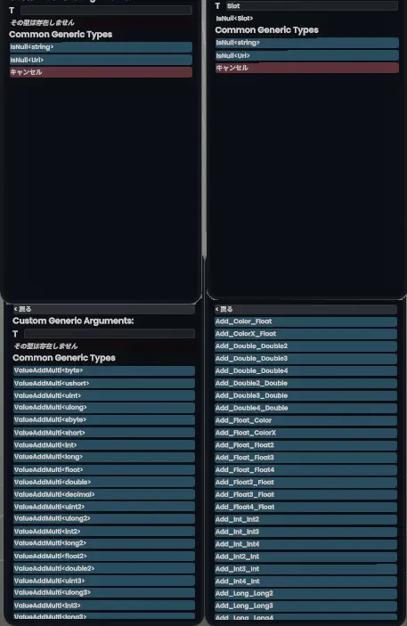
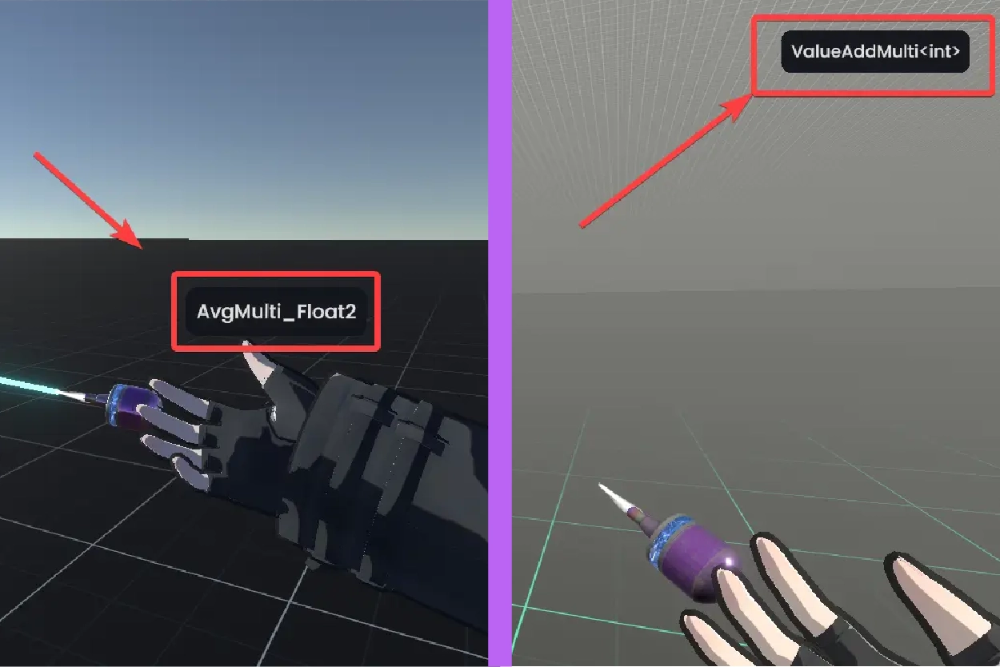
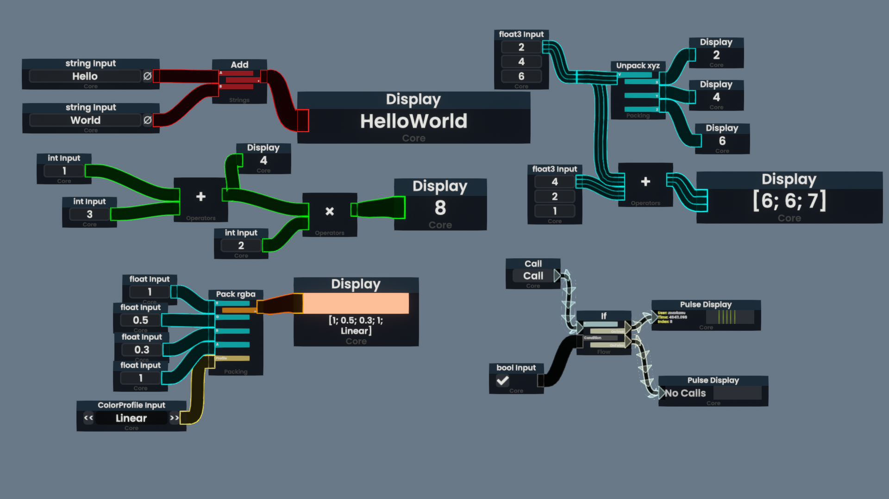

## ProtoFluxツール
ProtoFluxを記述するのに、特別な環境構築は必要ありません。Resoniteがあればその中でProtoFluxをコーディングできます。

**ProtoFluxツール**を装備すると、ノードの作成、接続、接続の解除などの操作ができるようになります。

### ProtoFluxツールの装備

_ProtoFluxツールのアイコン_
#### デスクトップモード専用
数字キーの「3」を押すとProtoFluxツールが装備されます。
また、数字キーの「1」を押すと、手に持ったツールの装備が外れます。

#### VR・デスクトップ共通
1. ダッシュメニューからインベントリを開きます
2. 自分のインベントリの一番上に移動し、`Resonite Essentials > Tools`を開きます。
3. 「ProtoFlux Tool（上のアイコン）」をダブルクリックして、ツールを取り出します。
   - アイコンが並んでるうち左から２番目にあります。

> [!warning] 編集ツールはセッション内での権限が必要！
> ProtoFluxツールや、Devツールなど、ワールドのデータやプログラムに干渉できるアイテムは、セッション内で **Builder（ビルダー）以上の権限が必要**です。
> 
> 基本的にホストユーザーはAdmin権限を持っていることが多いですが、ワールドによっては中身をいじれないようにホストユーザーの権限がBuilder未満になっている場合もあります。
## ProtoFluxツールの操作
ProtoFluxツールで行う操作は、主に３つあり、
1. **ノードの選択**
2. **ノードの作成、接続と接続の解除（リボンの削除）**
3. **ノードのパッキングとアンパック**

この３つです。

---
### ノードブラウザ
ProtoFluxツールを装備した状態でコンテキストメニューを開くと、メニューの中に**ノードブラウザ**という項目が表示されます。

_ノードブラウザボタン_

ノードブラウザボタンを選択すると、ノードブラウザが出現します。

#### ノードブラウザの色分け
- **Bool Vectors >**   のような暗い黄色は、**フォルダ（カテゴリ）** です。
  - フォルダの中にはさらにノードやフォルダが入っています。

- **Add**のような紫色、または**IsNull\<T>**のような緑色のボタンは、**この中に複数の型に対応したノードがあること**を示します。
  - ダブルクリックすると、どの型を使うかを選択する画面が表示されます。
  - 要するにC#で言うオーバーロードとほとんど同じことを手動でやるものです。

- **PlayOneShot** のような青色のボタンは**ノード選択ボタン**です
  - **これをダブルクリックすると、装備しているProtoFluxツールの選択ノードがクリックしたものになります**。

> [!note]- 型の選択
> 
> _数値型（画像下部）と参照型（画像上部）それぞれのバリエーションがあるノードの選択画面_
> 数値型や参照型を選択する必要があるノード（算術演算のほか、オブジェクトに関するもの）では、型を選択する必要があります。
> 
> 特に、<u>オブジェクト型は正確に型名を入力する必要があります</u>。
> 
> **ですが！なんと！**　ほとんどの場合、**型が異なるノードを接続しようとすると、ノードの型が勝手に変換されます**。
> 
> 詳しくは下で説明しますが、例えばint型の足し算ノードにfloat型のリボンを接続しようとすると、足し算ノードが勝手にfloat型のものに変化します。
> また、足し算ノードの片方に既にfloat型のリボンが接続されている場合、もう片方のリボンがintからfloatに変換されます。
> 
> つまり、数値型に関しては後に置くノードの型はノードを繋いだときに勝手に変換されるので、型は適当に選んでも大丈夫だということです。

>[!info] 現在選択中のノードの表示
> 
> ProtoFluxツールを装備してノードブラウザからノードを選択（ダブルクリック）すると、現在どのノードが選択されているかを示すラベルが表示されます。
> 
> デスクトップモードでは**画面右上**に、VRモードでは**ProtoFluxツールの真上**にラベルが表示されます。

---
### ノードの配置
ノードを選択した状態で空中を**ダブルクリック**すると、ツールの先端のあたり（デスクトップモードの場合は画面の中心）にノードが出現します。

ノードの削除は通常のアイテムと同様に、ノードを手に持ってコンテキストメニューを開いて**破棄**を選択することでできます。

---
### 入力・ディスプレイ・リレーノード
ProtoFluxツールの装備中は、ノードの接続部分から**ワイヤー**を引っ張り出せます。

ワイヤーを引っ張り出した状態でセカンダリを押すと、**入力ノード**または**ディスプレイノード**が出現します。

_入力（input）、ディスプレイ、リレー（右上2,4,6のすぐ右にある）ノード。いずれのノードも大きさを自在に変えられる。_

#### 入力ノード（Input）
**ノードの入力側（左側）からワイヤーを引っ張り出してセカンダリ**を押すと、**入力ノード**が出現します。

対応した型に応じた**入力欄があるノード**です。`int`や`float`などの基本的な数値型、`float3`などのベクトル型、行列（`float3x3`など）、色（`ColorX`）などのほか、一部のオブジェクト型やイベント入力にも対応しています。

右下の**Call**と書かれたノードは、インパルス（アクションを駆動するための信号）を発するためのノードです。クリックするとつながったノードにインパルスを送り出します。

#### 出力ノード（Display）
**ノードの出力側（右側）からワイヤーを引っ張り出してセカンダリ**を押すと、**ディスプレイノード**が出現します。

出力ノードは、ProtoFluxのその地点での**出力値を表示するノード**です。

基本的にデバッグ専用のノードで、きちんと表示をしたい場合はWriteやDriveノードなどを使います。

インパルスのディスプレイノードは、そのノードにどれだけインパルスが届いたかを表示します。

---
#### リレーノード
**ワイヤーに向かってグラブを行う**と、その場所に**リレーノード**が生成されます。

リレーノードは、ProtoFluxの中で**値を複数の場所に送ったり、複数のインパルスをまとめる**ためのノードです。

（かなりワイヤーっぽい見た目をしていますが、厳密にはノードです）

---
### ワイヤーの接続・切断
引っ張り出したワイヤーを他のノードの接続部分に持っていって手放すことで、ワイヤーを接続できます。

基本的に同じ型の接続部にしか接続できませんが、型の変換が可能な場合は自動で型を変換してくれます。

また、ProtoFluxツールを装備してトリガーを押しながら動かすと、トリガーを押し始めた部分とツール先端の間に赤い線が表示されます。

赤い線とワイヤーを交わらせてトリガーを話すと、ワイヤーが削除されます。

---
### パッキング・アンパック
ProtoFluxをSlotの中にしまいこむことを**パッキング**と呼びます。

これから、アイテムやワールドにギミックを作るためにたくさんのProtoFluxをつくっていくことになります。沢山のノード整然と並び、計算をしていく光景は確かに圧巻かもしれませんが、ちょっと見た目がごちゃごちゃしてしまいます。

つくったProtoFluxはアイテムやワールドの中にしまいましょう！
#### パッキングの手順
1. パッキングするProtoFluxに向かってセカンダリ長押しをして選択します
   - ひとつなぎのノード全てが選択され、**濃い水色**になります
2. DevToolに持ち替えて、インスペクターを開き、パッキングしたいSlotを表示します
3. ProtoFluxツールに持ち替えて、インスペクター上のパッキング先のSlotをグラブします
   - Slotをグラブすると手のあたりに『Slot名(ID12345600)』のような表示が出ます
4. <u>グラブしたままコンテキストメニューを開き</u>、「○○にパッキング」をクリックします
---

パックされたProtoFluxを取り出して編集できる状態にすることを**アンパック**と呼びます。

---

#### アンパックの手順
1. DevToolに持ち替えて、インスペクターを開き、ProtoFluxがパッキングされたSlotを表示します
2. ProtoFluxツールに持ち替えて、インスペクター上のSlotをグラブします
3. <u>グラブしたままコンテキストメニューを開き</u>、「○○をアンパック」をクリックします

### その他の操作
ProtoFluxに限らずResoniteには編集を楽にする操作がいくつかあります。

特にデスクトップモードの場合、**UIフォーカスモード**を使うことでUIを画面にスナップさせたり、ProtoFluxのノードをきれいに並べたりすることができます。

>[!note] 作業効率を上げる操作Tips
> #### オブジェクトのスナップ（VR・デスクトップ共通）
> - ノードを<u>**レーザーで</u>持ちながらトリガー（クリック）** を押すと、ノードがまっすぐ正面を向いてくれます
    >   - もう少し正確な言い方をすると、上下左右前後の６面のうち一番角度が近い面を正面として、ロール角とピッチ角を0にしてくれます。
> #### リレーノード（VR・デスクトップ共通）
> - ワイヤーをグラブすると、グラブした場所にリレーノードが生成されます。
    >   - **分岐をつくるため**に使えるノードです
> #### UIフォーカスモード（デスクトップモード専用）
> - ノードやインスペクターに向かって**Ctrl** + **左クリック**を押すと、クリックした対象にフォーカスします。
    >   - このカメラモードを**UIフォーカスモード**と呼びます。
> >[!abstract] UIフォーカスモードでの操作
> > |操作キー|動作|
> > |:--|:--|
> > |**Ctrl + 右クリック + マウスドラッグ**|視点の移動|
> > |**F5キー**|UIフォーカスモードの解除|
> > | <u>**アイテムを持ちながら左クリック**</u>|<u>フォーカスしたUIと同じ平面へのスナップ</u>|
> UIフォーカスモードではインスペクター等を**BlenderやUnityと近い感覚で操作できるようになる**ほか、**アイテムを持ちながら左クリック**を押すと、 フォーカスした**UIと同じ面上にアイテムがスナップします**。
>
> デスクトップモードではこの機能を使って、ノードをきれいに並べながらコーディングすることができます。
>
> また、基本的にこの記事で使うProtoFluxの写真は、UIフォーカスモードで撮影したものになります。