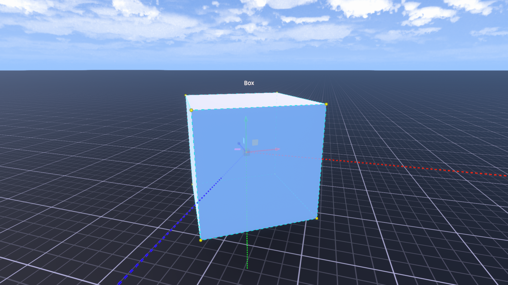

Dev ToolはResoniteでの開発作業をするためのツールです。 

- オブジェクトの選択
- 選択したオブジェクトのインスペクター（情報パネル）を開く

などの機能があります。
## DevToolを装備する方法
> [!help] 注意
> DevToolは、**Builder**または**Admin**権限でないと装備できません。
### デスクトップ
数字キーの「２」を押すことで装備できます。
### VR
1. インベントリを開き、`インベントリ > Resonite Essentials > Tools` を開きます。
2. 左端の方にある「Dev Tool」をダブルクリックして、ツールを取り出します。
3. ツールに照準（レーザー）を合わせ、トリガーを引き、でてきたメニューの「Development Toolを装備」を選択すると装備できます。
## DevToolの機能
### オブジェクトの新規作成
Dev Toolの装備時コンテキストメニューに追加される「新規作成」ボタンから、新しいオブジェクトを作成できます。
#### 作成できるオブジェクト（抜粋）
- 空のオブジェクト
- 3Dモデル（各種）
  - 立方体
  - 球
  - クアッド（ただの板）
  - 等…
- コライダー（各種）
- エディター
- ライト
- マテリアル（各種）
- オブジェクト
  - カメラ
  - ミラー
  - ポータル
  - 空のUIX
  - 等…
- テキスト
- パーティクルシステム
### オブジェクトの選択
Dev Toolを装備した状態で[セカンダリ](../basic-of-resonite/intro.md#セカンダリー)を押すと、狙っているオブジェクトを選択することができます。
選択したオブジェクトにはオブジェクトのXYZ軸それぞれの方向を示す**ギズモ**（画像中央の３つの矢印）と、選択したオブジェクトの大きさを示す枠が表示されます。

*選択オブジェクトの上方にオブジェクト名が表示される（画像では箱の上に"Box"と表示されている）*
### インスペクターを開く
何かを選択した状態でコンテキストメニューの「インスペクターを開く」を選択すると、そのオブジェクトの情報が表示された[インスペクター](../basic-of-resonite/inspectorUsage.md)が出現します。
> [!note] ヒント
> 何も選択していない状態でインスペクターを開くと、ワールド内のオブジェクトの一覧だけが表示されたインスペクターが出現します。

詳細は[インスペクターの使い方](../basic-of-resonite/inspectorUsage.md)を参照してください。
### 選択の解除
コンテキストメニューの「すべて選択解除」を選択すると、選択中のオブジェクトすべての選択を解除できます。

ギズモを消す方法はコレです。
## ギズモの使い方
オブジェクトを選択している間、コンテキストメニューに「ギズモオプション」が追加されます。

ギズモオプションから
- 移動
- 回転
- 拡大縮小
のモードを切り替えられます。

DevToolを装備した状態でギズモをドラッグすると、ギズモのモードに応じて移動、回転、拡大縮小ができます。
### 移動
ギズモの矢印をドラッグすると、その方向にオブジェクトを移動できます。２つの軸の間にある平面をクリックすると、その平面上でドラッグできます。
### 回転
ギズモの円をドラッグすると、円を回転面としてオブジェクトを回転させられます。
### 拡大縮小
ギズモの立方体をドラッグすると、オブジェクトを拡大縮小できます。