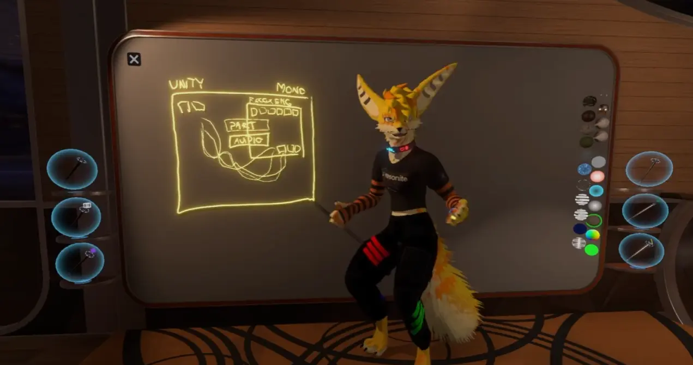
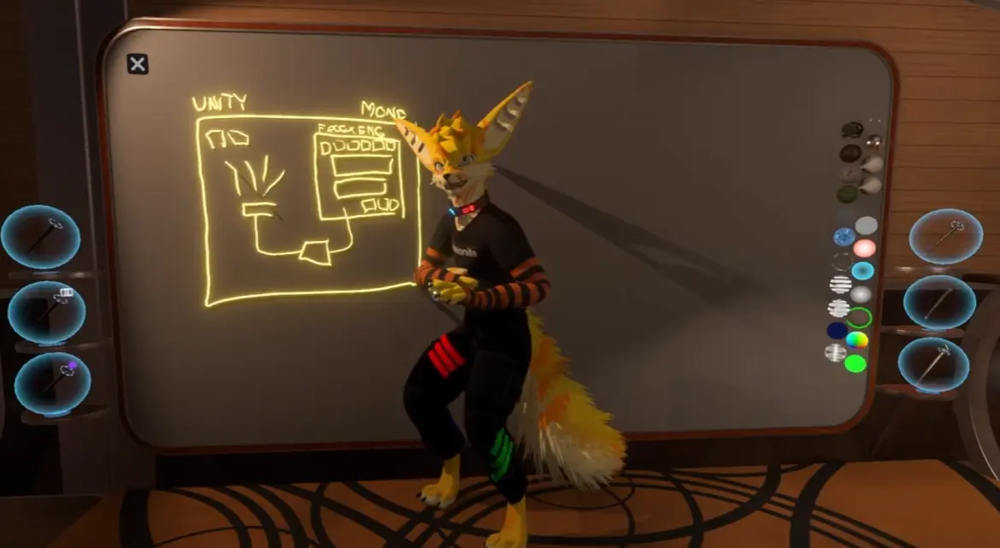
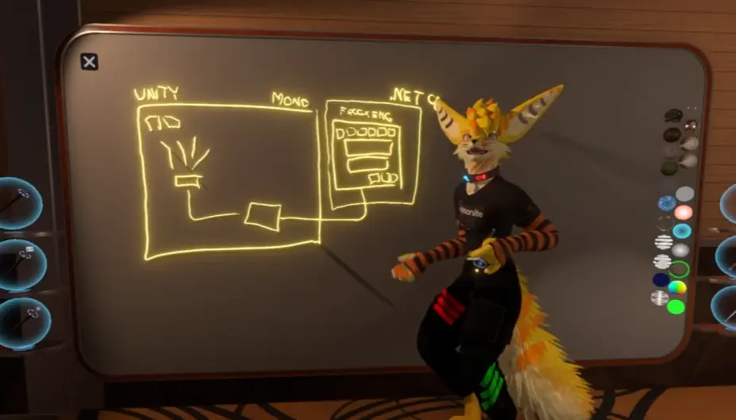
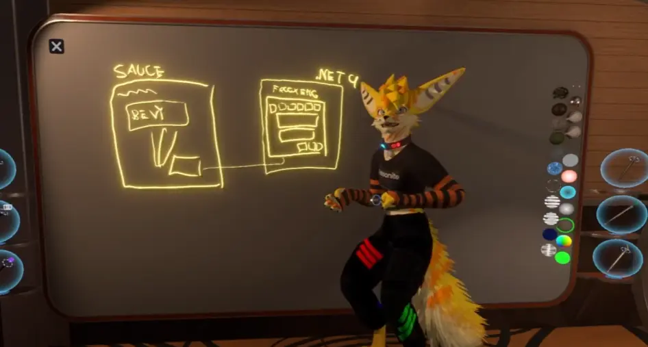
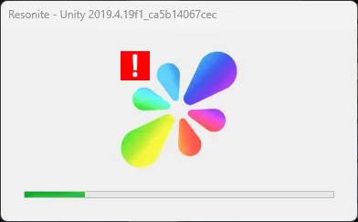
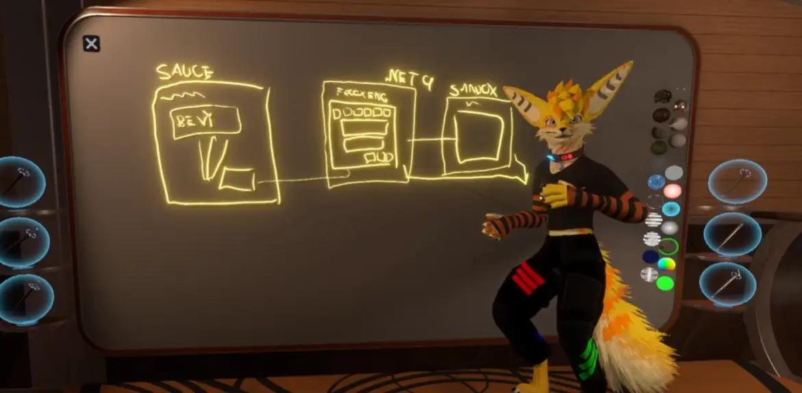

[https://www.youtube.com/watch?v=9cx2-VtL_LM](https://www.youtube.com/watch?v=9cx2-VtL_LM) のまとめ・解説もどき

翻訳というか翻訳に加えて勝手にあれこれ付け足したものです。誰でも読めるようになるべく簡単に書きました。

### 現在のResoniteはUnityと絡みついている

いまのResoniteは、UnityとFrooxEngineが密に結びついています。プログラミングの用語で言うところの密結合とかいうやつです。

（前提として、Resoniteではインスペクターを開いたり、ギズモを掴んで動かしたり、コンポーネントをアタッチしたり、かなりUnityで見たことあるような操作ができますが、これはUnityの機能を使ったものではありません。全てFrooxEngine上で動いており、つまりUnityとは別のプログラムによって動いています。）

ただし、「密に結びついている」と言いましたが、いまのUnityとFrooxEngineの関係は「すごく近い」というより「Unityの中でFrooxEngineを動かしている」と言うべきものになっています。

*現在のResoniteのアーキテクチャを簡単に示した図*

上の図では「PART(パーティクル)」「AUDIO」がFrooxEngineとUnityにまたがり、「その他こまごまとしたもの」が個別にUnityとデータのやり取りをしている状態を示しています。

これが現在のResoniteです。

上図の意味するところは

- パーティクル・オーディオでUnityの機能を直接使ってしまっており、Unityから離れられない（PART、AUDIOと書かれた部分）

- Unityと通信する部分それぞれが、独立してデータを送り合っている（下の方からにょろにょろ伸びてる線の部分）

ことです。上の状態でも、現にアプリは動きはしますが、問題があります。
### ランタイムが遅い

一般的にプログラムというものは、ソースコードを何かしらの方法でPCが実行できるプログラムに変換され、それが実行されます。

>ResoniteはMonoというランタイムを使用しており、これはかなり簡単に言うと同じソースコードのプログラムを違う環境でも実行できるようにするものです。
>言い換えると、ランタイムとは**いろんなOS、CPUに対応したバージョンのランタイムがあり、同じソースコードを同じように実行してくれるもの**である、とも言えます。

Unityの中にMonoのランタイムがあり、その中でResoniteは動いています。

問題はこのMonoがかなり古く、そして遅いことです。Resoniteが重たい理由の大体がこれ（に対してFrooxEngineの機能が大きすぎること）です。
### FrooxEngineのUnityからの独立と.NET9への移行
今、Resoniteが目指しているアプリの構造は下のようになっているみたいです。

上図の意味は
- パーティクルとオーディオの処理を完全にFrooxEngineの内部で行う（おおきい四角形）
- FrooxEngineとレンダラー（Unity）の間でやり取りをする経路を一箇所にまとめる（下から伸びた線）
  です。

もう少し具体的に言うと、例えば今のResoniteは、Unityのパーティクルシステムを使い、Unity側で音を鳴らしています。これをFrooxEngine側が音を鳴らすようにし、FrooxEngineの中でパーティクルの位置の計算を行うようにし、Unityに送る（Unityが処理する）のは描画に必要な情報くらいにする……ということです。

FrooxEngineとレンダラーの通信はプロセス間通信を使うようです。

そして、上の図にすることを達成できれば、FrooxEngineを完全にUnityの外に出せるようにもなります。（Frooxiusさんができるって言ってた）

Unityの外に出ることができれば、例えばランタイムも、Monoより新しい.NET 9に変えることができます。現在、ヘッドレスクライアントが.NET9になっていますが（ヘッドレスは描画とかがなく、Unity関連のしがらみがないため早期に.NETに移行できた）、パフォーマンスにとてつもない恩恵を得られます。

> ランタイムが新しくなって得られる恩恵は、例えば、より優れたガベージコレクションが使えるようになり一瞬だけフリーズする現象がなくなったり、全く同じコードでもより効率化されたマシン語に変換されるようになってPCの性能をフルに活かせるようになったりする、などがあります。

軽量化という点で見れば.NETに移行した時点でかなり軽くなると思います。
### レンダラーをUnityから内製のSauceへ移行する

仮にFrooxEngineとUnityとが独立したとして、この時点で、Resoniteの内部は

- FrooxEngineがResoniteに関するあらゆる処理を行う
- FrooxEngineからレンダラー（Unity）に「これをこう描画してください」とデータを送る

と、かなりシンプルに表せるようになっています。が、結局のところ「これをこう描画してください」と注文できる範囲も結局レンダラーができる範囲に留まります。

Resoniteとしては将来的に、UnityとFrooxEngineを独立させた上で、さらにレンダリングエンジンをUnityから別のもの（Sauce）に移行したい（する）ようです。この理由として

- Unityではリアルタイムで編集できるカスタムシェーダーを実装することが難しい。
- より効率的なレンダリングを行えるようにしたい

ことが挙げられています。

*将来的にはレンダラーをUnityからBevyエンジンベースのSauceに切り替える予定*
Sauceの詳細: https://wiki.resonite.com/Sauce
> **Sauce**（**Sourceではない** ）はResoniteが独自に開発している（厳密にはResoniteやYellowDogManStudiosとは別のチームが開発しているが）レンダリングエンジンです。

Sauceへの移行は比較的容易らしく、
「FrooxUnityからSauceへ移行する際、Unityから変わる部分やSauce特有の機能に対応する必要はあるが、原則として『FrooxEngineはその中で処理がまとまっており、描画するための情報は別でレンダラーに送る』ようにできているので、移行はそこまで大変ではない」らしいです。

またSauceの役割はResoniteというアプリ全体から見ると「FrooxEngineから送られてきたデータの通りに描画をする」ことなので、プロセスを別にすることができ、つまりC#で書く必要はありません。実際にRustで書かれているようです。（BevyがRust製なのでそれはそうなのだが）

### マルチプロセスアーキテクチャへの移行

現在のResoniteでは、基本的にResoniteのどこかで致命的なエラーが発生するとアプリ全体がクラッシュしてしまいます。

*Resoniteでよく目にする光景。ネタにしがちだが楽しいものではない。*

Resoniteは将来的により安定性を高めるために、システムのサンドボックス化・マルチプロセス化を計画しています。

具体例として
- セッションごとに（Resontieは同時に複数のセッションに参加できる）プロセスを実行するようにして、どこかのワールドで致命的なエラーが発生してもアプリ全体が停止しないようにする
- レンダラーにエラーが発生・クラッシュしても一時的に何も見えなくなるだけで、自動的にレンダラーを再起動・復帰するようにする
  ような機能の実装が挙げられています。

*ユーザーが直接触る部分（ワールド等）をSandbox（子供が遊ぶ"砂場"の意味）化する構想。クラッシュする可能性のある部分をメインのプログラムから隔離する。*

上図ではResoniteのアプリ全体を
- Resoniteのアプリ全体を管理するメインのプロセス
- レンダリングを行うプロセス
- ワールド等のサンドボックス化された部分のプロセス（複数）
  に分ける構想が示されています。

これは軽量化というより、安定化・セキュリティの安全性に寄与します。

> なんだかよくわからない話ですが、アプリ全体を管理する処理とそれぞれの仕事を行う処理で分けるしくみは、ChromeやFirefoxなどのWebブラウザで使われているものです。実際、どこかのタブでエラーが発生してもブラウザ全体がクラッシュすることはまれでしょう。

### PhotonDustのシステム
（もうほとんど実装されてはいますが……）

Unityから離脱し、FrooxEngineに実装されたパーティクルシステム、PhotonDustは、Unityから脱却することに加えて非同期で動作するように作られています。

実際、非常に重たいパーティクルを出してみると（1,000,000個くらい出すとわかりやすいかも）、パーティクルの動きはカクつくもののResonite全体のFPSはほとんど下がらないはずです。

PhotonDustでは
- 画面の更新の処理
- パーティクルの位置の計算
  を別々に行っています。

- 「パーティクルの動きはカクつくもののResonite全体のFPSはほとんど下がらない」
  をより細かく、回りくどくいうと、
- 「パーティクルの位置の計算に時間がかかっていたので、計算が終わるのを待たずに以前のパーティクルの状態をそのまま表示した」
  となります。　これが非同期処理の利点です。

### 新オーディオシステム

PhotonDustの次に実装されるシステムです。
（特に具体的な機能は触れていませんでした。）

これが実装されると、レンダリング以外でUnityとFrooxEngineが通信することがなくなります。
現在はUnityを経由して音を鳴らしていますが、FrooxEngineから直接音を鳴らせるようになるためです。

Unityからの離脱の準備ができるようになります。