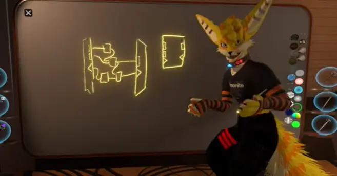

https://www.youtube.com/watch?v=ut2lVuflbcg の翻訳・解説もどきです。注釈や、個人的に思ったことは引用ブロックの中でしゃべっています
> こんなかんじ
## ネストノード（カスタムノード）の構想
**ネストノード**、（**カスタムノード**とも言及される）は、複数のノードを組み合わせて新たなノードを定義できるようにする機能、あるいはそのようにしてつくられたノードそのものです。

ユーザーの間で
- カスタムノード
- ネスト（入れ子）ノード
- 関数

などと呼ばれているものです。

動画によると
- 入力ノード
- 出力ノード
- 入力から出力を計算する数々のノード（つまりカスタムノードの中身）

でノードを定義、つまりは作成できるようにする構想があるようです。
> 
> 
> `入力用ノードと出力用ノード、できあがったノードの図`

> 要は**同じような処理を１ノードにまとめて簡単に使いまわせるようにしよう**ということです。

これはパフォーマンスが優れているだけでなく、ライブラリ（便利プログラム詰め合わせみたいなもの）としてカスタムノードを配布できるようにもなります。

また、カスタムノードの機能自体はFrooxEngine側では対応してないものの、ProtoFluxVM内部にはすでに実装されているそうです。

## Web Assemblyの統合
現在のProtoFluxは、Resoniteの空間に直接ノードを配置し、リボンを（辺）つないでプログラムを構築するプログラミングできる、ビジュアルプログラミング言語として実装されています。

これは記述自体は簡単にできる一方、プログラムが複雑になると文字通り見通しが悪くなります。

**将来的にはノードプログラミングだけでなく、ProtoFluxにWeb Assemblyを統合**し、一般的なプログラミング言語を利用してロジックを構築できるようにする構想があります。

具体的には**Web AssemblyによるProtoFluxノードの作成**（定義）をできるようにすることで、ノードプログラミングの中にテキストプログラミングを組み込めるようにするようです。

動画では、これを電子回路の「複雑な回路を一か所にまとめたICを作り、それをまた数ある回路のうちの一つとして使う」ように例えています。
> Web Assemblyとは、書いたコードからWeb Assembly用のバイナリを作り、Web Assemblyランタイム上の仮想的なCPUの上で実行できるようにする仕組み、ルールです。Web Assembly専用（共通）の機械語をそれぞれの環境で実行するものなので、Web Assemblyにコンパイルできるしくみさえあれば好きな言語でプログラムを書けます。

## トレイトのようなものに基づいたカスタムノードの作成・利用
入力・出力の型が特定の組み合わせであれば、カスタムノードそれ自体をProtoFluxに限らず他のシステムに組み込むことができるようにする構想があるようです。

動画では例として、ProtoFluxを使ってパーティクルシステム用のモジュールを定義できるようにする構想が説明されています。

> 
>
> `上から順にPOS、LIFETIME、DIRECTIONと書いてある（そう言いながら書いていた）。`

例えば以下のように作ったノード
- 入力
  - パーティクルの位置(実際に作るとすればfloat3)
  - パーティクルの速度(〃float3)
  - パーティクルの寿命(〃float)
- 出力
  - パーティクルの次のフレームでの位置(〃float3)

これを、パーティクルの位置を決めるモジュールとして使えるようにしよう、というものです。

また、同じように
- 入力
  - UV座標
- 出力
  - 色

のようなノードをプロシージャルテクスチャとして扱えるようになったり、また複雑になるものの
- 入力
  - いろいろなパラメータ
  - インパルス
- 出力
  - メッシュ

のようにしてプロシージャルメッシュ、同様にしてプロシージャル〇〇を定義できるようになる可能性にも言及しています。

> プロシージャルメッシュってProtoFluxできるの？と思うかもしれませんが、典型的なメッシュデータはざっくり
> - 各頂点の座標のリスト
> - 各頂点のUV座標のリスト・頂点カラーのリスト
> - ポリゴン（何番目と何番目と何番目の頂点で三角形を作るか）のリスト
> 
> なのでリストを扱えられれば（そのうち実装されるらしい）ProtoFluxでも十分実装できるものだと思います。大変そうだけど。
## DSP（デジタル信号処理）システムの実装
DSPシステムというとかなりフワッとした言い方ですが、**Resoniteでメッシュ、音声、テクスチャとかをProtoFluxで、リアルタイムに編集できるようにしよう**、というものです。

これはProtoFluxを使って
- メッシュ編集（Blenderで言うところのモディファイヤーや、ノードエディタそのもの）
- オーディオ編集
  - エフェクター
  - プロシージャル効果音
などを可能にしようという構想です。

例えば
- ワールドの状態に応じて音にかけるエフェクトをリアルタイムに（インタラクティブに）変更する
- メッシュを受け取り細分化（ポリゴンを細かくなめらかに）する
- 素材の音・エフェクトのパラメータや組み合わせを変えて効果音を作る

ようなしくみをProtoFluxで表現できるようにしよう、というものです。

これに加え、ProtoFlux自体が持つ複数人でリアルタイムに共同編集ができる特性や、Resonite自体のソーシャルプラットフォームとしての機能とが組み合わさり、例えば
- ほかの人を招いて共同で効果音制作をする
- よく使う機能や作った効果音をテンプレートとしてまとめてインベントリに（あるいはワールドとして）保存する
- テンプレートを公開・配布する
- できあがったアセットを外部にエクスポートする

など、**Resoniteをインタラクティブなアセット制作ツールとして使えるようになる可能性**にも触れられています。

また、ProtoFluxで扱える実装されるため、既存のProtoFluxで扱える部分と組み合わせることが可能であることにも言及しています。
### 非同期処理
DSPメカニズム自体は非同期で動くように実装されるようです。（PhotonDustと同様）

計算が膨大だったり複雑だったりでメッシュの生成に時間がかかる場合でも、Resonite全体がフリーズすることはなく、単にメッシュの生成が遅くなるだけで済むようになります。

