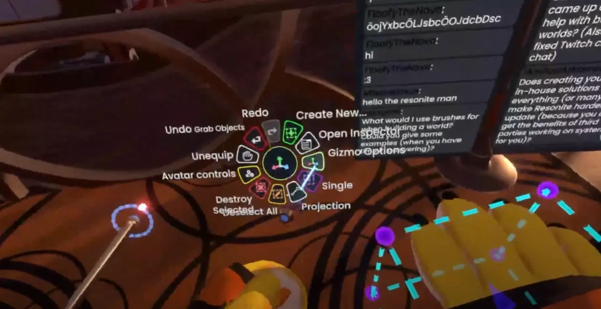
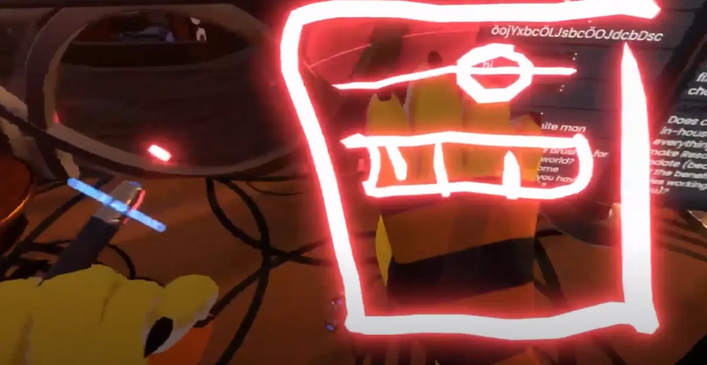

https://www.youtube.com/watch?v=aqKedwMIzp4 のまとめ・解説

## Tool UI Facetの実装
現在、Resoniteのツール類のオプションはすべてコンテキストメニューから操作します。

特に[DevTool](../tool-usage/devTool.md)などを装備している場合、コンテキストメニューが細かくなったり、階層が深くなったりすることがあります。

慣れているユーザーなら問題ないかもしれませんが、初心者にとっては使いづらいですし、何よりボタン以外のUI要素、例えばスライダーなど、が使えません。

そこで、将来的にはツールのオプションを操作するためのUI Facetの導入が計画されています。

*Tool UI Facetの図。右手のFacet Anchorにつけている……ように見せている。*

操作感としては現実世界で言うところの絵筆とパレットの関係と似ているかもしれません。

それぞれのツールが持つUIの構成データをもとに、UI Facet側でUIを構成・表示するものになるらしいです。（多分、装備するツールに応じてTool UI Facetが変わったり、Tool UI Facetの要素の見た目をカスタムできる、のだと思う）

FacetなのでFacet Anchor以外の場所にもくっつけられるようになるらしいです。
