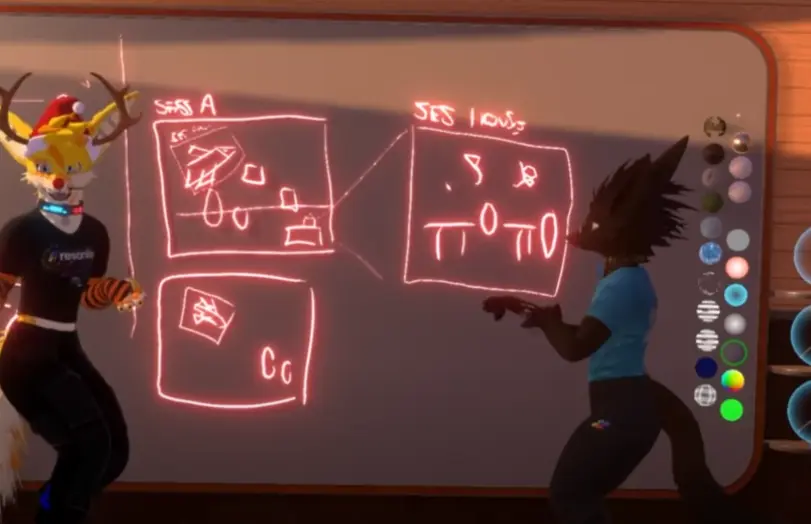

https://youtu.be/a8t6-k84cok の翻訳・解説もどきです。内容が正しい保証はありません！

## ドメインシステム
> [!info]- 「ドメイン」の意味
> ドメイン（Domain）は、日本語では「領域」「領土」「分野」などと訳される言葉です。インターネットの文脈における「ドメイン」が有名でしょうか。たとえばここのサイトのドメインは「zozoka.su」です。

### ドメインの概要
**セッション同士をシームレスに（見た目も）接続できるようにして巨大な空間を作れるようにしよう**（複数のセッションをつなぎあわせて仮想空間を作れるようにしよう）という構想です。

ドメインシステムを使い、下の画像のようにセッション同士を接続して自由に行き来できるようになる、らしいです。

> 
> `ドメインシステムの基本的な概要　Session A（中央）とSession 1（右）と左のセッションが地続きになっている様子を表した図`

> [!info]- 注釈 - 今の時点でも巨大空間を作れるが、広さを活かしきれない
> ワールドの原点からおよそ1000m以上離れると計算・描画の誤差が目に見えるようになり、さらに離れていくごとにどんどんゲーム内のあらゆるオブジェクトの見た目が崩れていきます。コンピュータで扱われる数字の仕組み上、避けることが難しい問題です。
>
> 現在のResoniteでも、超巨大なオブジェクト（リアルスケールの北海道とか）を配置してその上を歩き回ること自体はできますが、ある程度遠くに行くとメニュー・アバターなどが正しく描画されなくなっていくため、現実的な行動範囲は結局、一辺数千mの立方体の範囲にしかなりません。

> 「ドメイン」とは何なのかについて、動画というかResonanceの配信自体が「Resoniteで将来こんなことやりたいね」を話すものなので、厳密な仕様には触れられていません。
>
> しかしながら、上の動画ではFrooxiusさんが
> - セッションをシームレスに接続する**ドメインシステム**というしくみ
> - ドメインシステムを使い**ドメイン（セッション）同士を接続できる**
> - 接続された**ドメイン同士は自由に行き来できる**
> 
> などのように説明しているほか、[こちらのissue(GitHub上)](https://github.com/Yellow-Dog-Man/Resonite-Issues/issues/702) でも「ドメイン」の構想について触れられています。
> 
> **ワールド・セッションの一般化**、あるいは**動的に扱えるようにする概念**として、ドメインシステムのアイデアがあるようです。

複数のワールドを地続きにして、直接行き来できるようにするという点ではセカンドライフのリージョンと似ていますが、ドメインシステムでは**ワールド同士の接続を自由に設計できる**ようにするアイデアがあるようです。例えば、
- ドメイン同士を隣接させる
- ドメインの中にドメインを配置する
  - 配置してある机の上を丸ごと別のドメインとする
  - 移動する乗り物の内部を別のドメインとする 

など。

動画ではこれを利用して、例えば
- グリッド状にドメインを配置し、無限に広がる世界を作る
- 宇宙船（ドメイン）の中に乗りながら別のドメインに移動する
- 惑星の表面に街となる小さいドメインを配置し、地球全体を直接行き来できるようにする
- その地球もまた宇宙の中にある一つのドメインとして扱う

ことができるようになるだろうと説明されています。

> 
> `session A（左上）の机の上にsession 1（右の拡大図）を配置した図。このほか宇宙船に乗りながら乗り物ごと別セッションに移動するアイデアも示されている。`

もちろん、ドメインは必ずどこかに接続しなければならないわけではなく、ドメインをどこにも接続しないようにもできるようです。

### メタドメイン
動画では、ドメイン同士の通信を制御するための機能、またはドメインのまとまりそれ自体のことを`メタドメイン`と呼んでいます。

> 
> `複数のドメインを包括するメタドメインの概念。メタドメインが中継してドメイン同士で情報のやりとりをするしくみ（右下の□）について触れている。`

メタドメインを利用するしくみとして、`External Representation（対外グラフィック）`についても触れられています。これはセッションの外から見たときにどのように見えるかを制御する仕組みであると説明されています。
> `External Representation`を対外グラフィックと訳しましたが、説明からして「外からどう見えるか」、「外からの見た目」のことです。

前提として、ドメインシステムで隣のドメインの様子が見えたらいいねというアイデアがあります。ドメインの内容全てを同期するのは大変なので、各ドメインでExternal Representationを生成、同期することで、現実的な方法で外からドメインの様子が見られるようにしよう、というアイデアです。

実際に、これはある種のLoDシステム（Level of Detail、オブジェクトが遠くにあるときに粗く表示して負荷を抑えるしくみ）のような機能になるだろうと説明されています。

ドメイン間でExternal Representationを同期させることで、例えば
- あるドメインで巨大なオブジェクトを出したときに、他のドメインから見たときにもそのオブジェクト（の簡素化されたグラフィック）が描画されるようになる

が可能になると説明されています。

このほか
- 複数のドメインに同時にイベントを送信する

アイデアにも触れていました。

